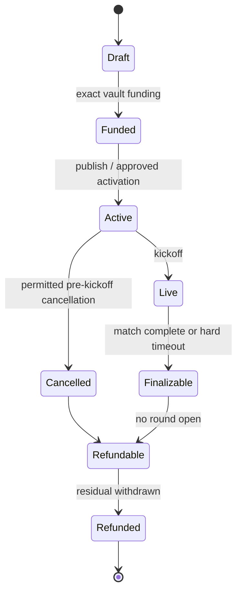
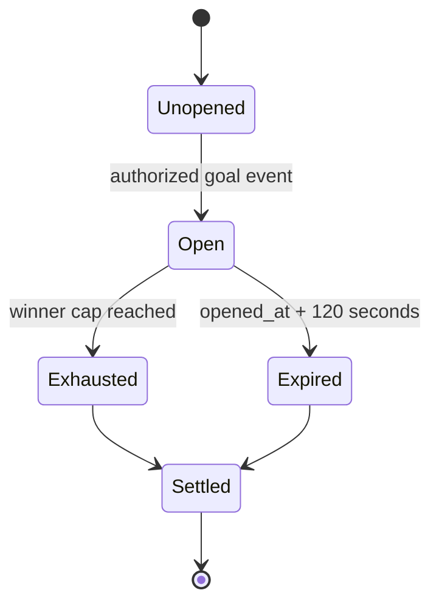
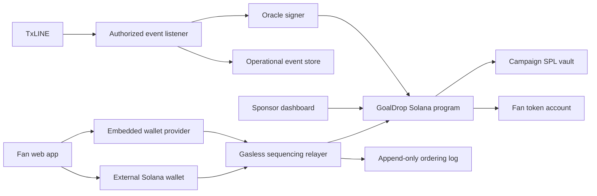

# GoalDrop — Product Requirements Document

> **Working title:** GoalDrop
> **Tagline:** Real-time rewards for real football moments.
> **Status:** Hackathon MVP specification
> **Target:** Solana Devnet demonstration, designed for a gated Mainnet rollout
> **Track:** TxODDS Consumer and Fan Experiences

---

## 1. Executive Summary

GoalDrop turns the emotional peak of live football—a goal—into a sponsor-funded, on-chain reward race.

A sponsor selects a TxLINE match, configures and prefunds a fixed number of goal reward rounds, and publishes the campaign. Fans join before kickoff using either a passkey-provisioned embedded Solana wallet or an existing Solana wallet. When GoalDrop's authorized TxLINE listener detects any goal, the application erupts into a full-screen celebration and opens the next reward round. The first eligible claim requests accepted by the GoalDrop relayer receive the configured SPL-token reward. Claims are gasless for fans, enforced by a Solana program, and auditable through transaction links and relayer receipts.

The hackathon product is a polished responsive web application, not a public widget SDK. The goal-and-claim experience is built as a reusable internal component and may be shown inside a mocked partner application to demonstrate future distribution.

### One-sentence pitch

> One live goal. One sponsor-funded drop. Fans racing to claim a real on-chain reward—without needing SOL or prior crypto knowledge.

### Why this should exist

- **Fans** get an immediate, visceral reason to participate during a live match.
- **Sponsors** turn passive impressions into measurable, high-intent interactions.
- **TxLINE** becomes the real-time event source that connects verified sports data to a consumer experience.
- **Solana** makes campaign funding visible, winner caps atomic, and rewards directly owned by fans.

### Truthful positioning

GoalDrop is **not fully trustless** in the MVP. Goal activation trusts an authorized TxLINE listener, and first-come ordering trusts the GoalDrop relayer. Solana provides program-enforced custody, eligibility, payout limits, duplicate prevention, and public settlement—not proof that the listener or relayer behaved impartially.

---

## 2. Context and Evidence

The project targets the [TxODDS Consumer and Fan Experiences hackathon track](https://superteam.fun/earn/listing/consumer-and-fan-experiences/).

TxLINE is TxODDS's sports-data product for fixtures, odds, scores, and settlement data. TxODDS states that TxLINE data is cryptographically anchored on Solana and that World Cup and International Friendlies data is available in real-time and delayed service tiers. The MVP uses TxLINE as the operational source for live match and goal events. See the [TxLINE product overview](https://txodds.net/our-products/tx-line/).

Open integration questions—such as exact goal-event identifiers, correction semantics, transport, licensing, and proof payloads—must be confirmed against authenticated TxLINE documentation before implementation is considered production-ready.

---

## 3. Problem Statement

### Fan problem

Live football creates intense, short-lived moments, but most digital fan products reduce participation to passive score updates, chat, or pre-match predictions. Crypto reward experiences add further friction by requiring wallet installation, seed-phrase knowledge, and SOL for fees.

### Sponsor problem

Sponsors pay for reach but struggle to create interactions that are:

- Synchronized with the most emotional match moments
- Measurable from registration through reward delivery
- Fast enough to feel live
- Transparent enough to audit
- Repeatable across matches without custom engineering

### Product opportunity

Use TxLINE goal events to trigger short, scarce, sponsor-funded reward races, while hiding blockchain complexity from mainstream fans and preserving on-chain custody and settlement.

---

## 4. Goals and Non-Goals

### 4.1 MVP goals

1. Deliver a delightful goal-to-claim experience that judges can understand immediately.
2. Demonstrate a complete sponsor journey: select match, configure rounds, fund, publish, observe, and refund.
3. Demonstrate a complete fan journey: discover, register, experience a goal, claim, prove receipt, and transfer the reward.
4. Use TxLINE-shaped real-time match events through an authorized listener.
5. Keep reward custody and allocation constraints in a Solana program.
6. Remove consumer crypto friction with passkeys and gasless transactions.
7. Remain demonstrable when no live match or goal is available.
8. Establish explicit, testable performance, security, and accounting invariants.

### 4.2 Non-goals

- Match video, highlights, or broadcast streaming
- Prediction markets, gambling, wagering, or paid fan entry
- A public widget SDK or production Aave integration
- NFTs or collectible issuance
- Token-2022 support
- Multiple campaigns for the same match
- Team-specific goal triggers
- Full on-chain verification of TxLINE Merkle proofs
- Permissionless Mainnet sponsor activation
- Fiat on-ramp/off-ramp, swaps, or portfolio management
- Proof of personhood, KYC, or guaranteed one-human-one-account enforcement
- Sponsor branding uploads, theme builder, or organization management

---

## 5. Product Principles

1. **The goal is the hero.** The experience must change state dramatically when a goal occurs.
2. **No crypto prerequisite.** A new fan should not need an extension wallet, seed phrase, or SOL.
3. **Scarcity must be real.** Winner caps and reward balances are enforced on-chain.
4. **Fast, but honest.** Distinguish receipt, submission, confirmation, and finality; never show a winner before the claim is valid.
5. **Trust boundaries are visible.** Do not market authorized services as trustless.
6. **Sponsor liability is bounded.** Every possible payout is prefunded before activation.
7. **The demo must never depend on luck.** Devnet Demo Match Mode exercises the real product path.
8. **Accessibility survives spectacle.** Reduced-motion mode preserves information and urgency without intense effects.

---

## 6. Personas

### 6.1 Mainstream fan

- Watches a live match through an existing broadcaster
- May never have used a crypto wallet
- Wants an immediate, understandable reward interaction
- Uses a passkey and embedded wallet by default

### 6.2 Crypto-native fan

- Already uses Phantom, Backpack, or another Solana-compatible wallet
- Wants to connect an existing address
- Must receive the same eligibility and ordering treatment as passkey users

### 6.3 Sponsor campaign operator

- Selects a match and reward token
- Configures a bounded reward budget
- Funds and publishes the campaign from an external Solana wallet
- Needs campaign status, utilization, and refund visibility

### 6.4 GoalDrop operator

- Manages Mainnet sponsor and mint allowlists
- Operates and rotates admin, oracle, and relayer authorities
- Monitors TxLINE ingestion, claims, vault solvency, and service health
- Can pause new activations without seizing sponsor funds

### 6.5 Hackathon judge

- Must experience the full product in minutes
- May review outside a live match
- Needs visible proof that the experience uses real Solana state rather than a simulated balance

---

## 7. Core User Journeys

### 7.1 Sponsor creates a campaign

1. Sponsor connects an external Solana wallet.
2. Sponsor selects an eligible upcoming TxLINE fixture with no active campaign.
3. Sponsor selects an approved classic SPL token mint.
4. Sponsor sets the preregistration deadline; the default is kickoff.
5. Sponsor configures a maximum number of goal rounds.
6. For every round, sponsor enters a fixed amount per winner and winner cap.
7. Dashboard calculates total required funding in token base units.
8. Sponsor reviews the reversed-goal, first-come, and refund terms.
9. Sponsor deposits the exact required budget into the campaign vault.
10. Devnet activates immediately; Mainnet activation requires an allowlisted sponsor.
11. Campaign economics become immutable after activation.

### 7.2 Fan joins with a passkey

1. Fan opens the campaign page before kickoff.
2. Fan chooses **Join with passkey**.
3. The embedded-wallet provider creates or recovers a Solana wallet authorized through the passkey.
4. GoalDrop submits a gasless registration transaction.
5. The program creates a unique registration record for the campaign and wallet.
6. Fan sees **You're in** with match, sponsor, token, and round information.

### 7.3 Fan joins with an existing wallet

1. Fan chooses **Connect existing wallet**.
2. Fan connects a supported Solana Wallet Standard wallet.
3. Fan signs the registration authorization.
4. GoalDrop pays the transaction fee.
5. The same on-chain eligibility record is created as for a passkey user.

### 7.4 Goal triggers a reward race

1. The TxLINE listener receives a goal for the campaign fixture.
2. It validates fixture and campaign state, assigns a stable idempotency key, and records provenance.
3. The authorized oracle signer opens the next funded round on Solana.
4. The web app immediately enters the goal celebration state.
5. The claim control appears with exact reward, remaining winner count, and a two-minute countdown.
6. Registered fans submit signed claim intents.
7. The relayer durably assigns receipt sequence numbers in accepted-request order.
8. The program processes valid claims and atomically enforces the cap.
9. Fans see won, pending, missed, expired, or error states.

### 7.5 Winner uses the reward

1. Winner sees exact amount, token, successful rank, and transaction link.
2. Reward wallet shows the on-chain token balance.
3. Winner may copy the wallet address or transfer tokens to an external Solana address.
4. Swaps and fiat off-ramping are not provided.

### 7.6 Sponsor recovers unused funds

1. The listener reports official match completion, or the hard campaign timeout is reached.
2. No reward round may remain open.
3. Campaign becomes finalizable and then refundable.
4. Sponsor withdraws the vault's residual balance to the immutable refund address.
5. Payout and refund totals remain publicly auditable.

---

## 8. Functional Requirements

### 8.1 Match discovery

- Display eligible upcoming and live fixtures sourced from TxLINE.
- Show campaign status: upcoming, registration closed, live, exhausted, completed, or refunded.
- Allow only one active campaign per normalized TxLINE fixture ID.
- Do not present match video.
- Use a live score and match clock only when supported by the selected TxLINE tier.

### 8.2 Campaign configuration

- Accept one approved classic SPL mint per campaign.
- Reject Token-2022 mints.
- Configure one or more bounded goal rounds.
- Require nonzero amount per winner and nonzero winner cap.
- Calculate required funding as:

```text
required_funding = Σ(round.reward_amount × round.winner_cap)
```

- Use integer token base units and checked arithmetic; never floating point.
- Validate the vault mint, token program, decimals, and deposited amount.
- Make fixture, mint, rounds, refund address, and economics immutable after activation.
- Use hardcoded product/sponsor showcase branding in the MVP; no uploads.

### 8.3 Campaign lifecycle



- Devnet campaign creation and activation may be permissionless.
- Mainnet activation requires an on-chain sponsor allowlist.
- Cancellation is permitted only before kickoff and before any round has opened.
- Removing a sponsor from the allowlist prevents new activations but cannot seize an existing vault.
- A permissionless timeout finalization path must exist for abandoned matches or listener outages.

### 8.4 Registration and eligibility

- Registration closes at the configured on-chain deadline, defaulting to kickoff.
- Registration must be gasless.
- Each wallet may register once per campaign.
- Passkey and external-wallet fans use the same on-chain eligibility mechanism.
- Recommended MVP representation:

```text
registration = PDA(campaign, fan_wallet)
```

- The program—not the browser or backend—enforces the deadline.
- Registration is non-transferable and bound to the reward-recipient wallet.
- Late registrations must fail deterministically.

### 8.5 Goal ingestion and round activation

- The authorized listener consumes TxLINE match updates.
- It accepts events only for configured fixtures.
- It stores the raw payload, normalized payload, provider receipt time, digest, and Solana signature.
- Only the configured oracle authority may call live round activation.
- A single qualifying goal opens exactly one next funded round.
- Every goal qualifies regardless of which team scores.
- Regulation-time, extra-time, own-goal, and shootout semantics are **TBD pending TxLINE event definitions**; the chosen rules must be explicit before launch.
- Goals beyond the maximum funded round count create no reward window.
- Replayed or duplicated feed events cannot open additional rounds.
- A VAR reversal or later correction never clawbacks or cancels an already opened round.
- The campaign UI and sponsor confirmation must disclose this irreversible payout risk.
- Multiple rounds may coexist if goals occur within two minutes; each has an independent account, sequence, timer, and cap. The newest round receives primary UI focus while older open rounds remain accessible.

### 8.6 Round lifecycle



- A round closes when rewards are exhausted or 120 seconds have elapsed, whichever comes first.
- Solana's on-chain clock is authoritative.
- Round closure after expiry is permissionless.
- Closed rounds never reopen.

### 8.7 First-come claim ordering

The product definition of first is:

> The order in which GoalDrop's relayer accepts valid, signed claim intents—not browser click time, RPC arrival time, or validator execution order.

- Every accepted request receives an atomic, monotonic, round-scoped sequence number.
- The sequence is durably stored before the relayer acknowledges the request.
- Duplicate submission of the same intent returns the original receipt.
- The relayer returns a signed receipt containing campaign, round, wallet, intent hash, sequence, receipt time, receipt ID, and relayer signature.
- Signed intents must be domain-separated by cluster, program, campaign, round, wallet, recipient, nonce, and expiry.
- On-chain execution must reject sequence gaps, overlaps, duplicates, and invalid authorization.
- Ordered micro-batches are preferred if transaction size and compute benchmarks permit; otherwise out-of-order individual transactions must fail and retry.
- Receipt sequence is not automatically winner rank. A winner rank is consumed only by a successfully validated and paid claim.
- Failed or invalid earlier requests do not reserve a reward; the next valid request may win.
- This ordering is auditable but trusted. The relayer can still delay, censor, or reorder requests before issuing a receipt.

### 8.8 Claim settlement

For every successful claim, the program must prove:

1. Campaign is active.
2. Round is open and not expired.
3. Rewards remain.
4. Registration exists and predates the deadline.
5. Authorization matches the registered wallet.
6. Intent matches cluster, program, campaign, round, and recipient.
7. Wallet has not already claimed this round.
8. Recipient token account belongs to the claimant and campaign mint.
9. Sequence is processable under the ordering policy.
10. Transfer amount equals the configured per-winner amount.
11. Successful winner count remains at or below the cap.

Recommended duplicate guard:

```text
claim = PDA(round, fan_wallet)
```

- Claims are gasless for both wallet paths.
- The platform funds transaction fees and, when required, associated token-account creation.
- Missing token accounts are created idempotently.
- Retries are idempotent.
- The fan must never see a false success when only the receipt or submission exists.

### 8.9 Fan reward wallet

- Display campaign reward balances for supported tokens.
- Display claim history with status and Solana Explorer links.
- Allow copying the embedded wallet address.
- Allow sending a supported token to a valid external Solana address.
- Require explicit confirmation of token, amount, network, and destination.
- Define whether transfer fees remain platform-sponsored as an operational policy; the hackathon demo should sponsor them.
- Provider recovery, export, device loss, and cross-device behavior remain vendor-selection requirements, not assumed capabilities.

### 8.10 Sponsor dashboard

- Connect and display sponsor wallet and cluster.
- Browse/select TxLINE fixtures.
- Show whether the match slot is available.
- Select an approved mint.
- Configure deadline and goal rounds.
- Preview the complete fan campaign state.
- Calculate and fund exact maximum liability.
- Show activation, vault, rounds, claims, utilization, and residual balance.
- Expose refund action only when program conditions permit.
- Show sponsor-risk acknowledgements for reversed goals, FCFS ordering, and best-effort Sybil controls.

### 8.11 Devnet Demo Match Mode

- Demo Mode exists only on Devnet.
- It replays recorded or synthetic TxLINE-shaped events.
- An authorized demo operator can trigger a goal.
- The real program, vault, registration, relayer, claim, and settlement paths are used.
- UI permanently labels simulated events and tokens.
- Devnet and Mainnet use different program IDs and different admin, oracle, relayer, and treasury keys.
- Mainnet must reject or omit demo-trigger authority at the program/configuration level; hiding UI controls is insufficient.
- Every intent includes cluster and program ID to prevent cross-environment replay.

---

## 9. Experience and Motion Direction

### 9.1 Creative system

**Stadium broadcast meets arcade.**

- Dark stadium atmosphere
- Bold broadcast-style typography
- Match-derived team colors
- Legible live scoreboard, clock, reward, and winner count
- Premium sponsor placement without obscuring the interaction

### 9.2 Emotional sequence

1. **Anticipation:** restrained ambient motion and live match pulse.
2. **Goal:** full-screen shockwave, typography impact, crowd particles, confetti, and controlled camera shake.
3. **Race:** reward snaps into focus; claim button, remaining count, and countdown dominate.
4. **Pending:** immediate receipt acknowledgement without claiming victory prematurely.
5. **Winner:** rank, exact token amount, and on-chain proof reveal.
6. **Missed:** respectful, energetic explanation with the next possible round visible.

### 9.3 Accessibility and device behavior

- Respect `prefers-reduced-motion` and provide an in-product toggle.
- Reduced-motion mode removes camera shake, rapid zoom, and dense particles while preserving state transitions.
- Sound and haptics are optional, off until user interaction, and independently controllable.
- Do not encode win/loss state through color alone.
- Maintain keyboard navigation, visible focus, semantic announcements, and sufficient contrast.
- Optimize the claim control for one-handed mobile use.

---

## 10. Conceptual Architecture



### 10.1 Trust boundaries

| Boundary | What is trusted | What Solana guarantees |
|---|---|---|
| TxLINE listener | Correct detection and normalization of goals | Only authorized activation is accepted; duplicate keys can be rejected |
| Oracle signer | Does not open fraudulent rounds | Authority checks and immutable round state |
| Claim relayer | Honest request acceptance and ordering | Valid authorization, eligibility, caps, duplicate prevention, and token transfer |
| Embedded-wallet provider | Key security, recovery, and signing behavior | Valid Solana signatures and ownership after signing |
| Platform admin | Safe allowlists, authority rotation, and pause policy | Program-enforced scope of each authority |

### 10.2 Authority separation

- Platform administrator
- Mainnet sponsor-allowlist authority
- Mint-allowlist authority
- TxLINE oracle authority
- Claim relayer/receipt signer
- Devnet demo authority
- Sponsor wallet/refund authority

Authorities must be independently rotatable. Mainnet administration should migrate to a multisig or hardened signing service before handling material value.

---

## 11. Conceptual Domain Model

### Platform configuration

- Cluster and program identity
- Administrator and operational authorities
- Sponsor allowlist
- Approved mint allowlist
- Pause flags

### Campaign

- Campaign ID
- Normalized TxLINE fixture ID
- Sponsor wallet
- Reward mint and decimals
- Registration deadline
- Expected match end and hard expiry
- Maximum goal rounds
- State
- Vault
- Immutable refund address

### Goal round

- Campaign ID and ordinal
- Provider event key and digest
- Amount per winner
- Winner cap
- Opened-at timestamp
- Accepted payout count
- State

### Registration

- Campaign ID
- Fan wallet
- Registration timestamp

### Claim

- Round ID
- Fan wallet
- Intent hash and nonce
- Receipt sequence
- Successful winner rank
- Transaction signature and state

### Audit event

- Fixture, campaign, provider event, round, wallet, intent, receipt, sequence, transaction, cluster, program, and timestamps

---

## 12. On-Chain Invariants

These are hard correctness requirements:

1. One active campaign per normalized fixture.
2. One registration per wallet per campaign.
3. One successful claim per wallet per round.
4. One reward round per unique provider goal-event key.
5. Successful winners never exceed a round's cap.
6. Every winner receives exactly the configured amount.
7. The vault mint always equals the campaign mint.
8. A campaign cannot spend another campaign's vault.
9. Total paid plus residual refundable balance always equals funded balance, excluding separately accounted rent/fees.
10. Active or reserved funds cannot be refunded.
11. Refund destination cannot change after activation.
12. Expired or exhausted rounds never reopen.
13. A finalized/refunded campaign cannot activate new rounds.
14. Unauthorized activation, configuration, refund, and demo calls fail.
15. Demo activation is impossible on Mainnet.

---

## 13. Non-Functional Requirements

### 13.1 Performance targets

Per campaign, the MVP targets:

- 1,000 preregistered fans
- 500 claim requests within a five-second burst
- Up to 100 winners per goal round
- Relayer acknowledgement below 500 ms at p95
- Goal event to visible claim window below 3 seconds at p95, measured from listener receipt
- Winner confirmation or explicit pending state below 10 seconds at p95
- Zero cap over-allocation under concurrent load

These remain targets until measured through load and account-contention tests.

### 13.2 Reliability

- Duplicate event delivery and retry must be safe.
- Listener restart must reconcile provider cursor, audit records, and on-chain state.
- Relayer must not acknowledge a sequence before durable commit.
- Lost RPC responses must be reconciled before resubmission.
- Degraded services must expose honest states rather than false success.
- A hard finalization timeout must prevent indefinite sponsor fund lock.

### 13.3 Security

- Separate Devnet and Mainnet keys and programs.
- Keep admin, oracle, relayer, sponsor, and demo authority roles distinct.
- Bind signed intents to domain, cluster, program, campaign, round, wallet, recipient, nonce, and expiry.
- Validate classic SPL Token Program ownership and approved mint membership.
- Use checked arithmetic and checked token transfers.
- Rate-limit registration, claims, and sponsored transfers.
- Monitor relayer SOL balance and failed-fee spending; Solana charges fees even for failed transactions. See [Solana fee documentation](https://solana.com/docs/core/fees/fee-structure).
- Define emergency pause behavior for new activations and submissions without enabling arbitrary seizure.
- Complete an independent program security review before material Mainnet value.

### 13.4 Privacy

- Store the minimum WebAuthn/passkey account metadata required by the selected provider.
- Device-risk signals are best-effort, minimized, and subject to a retention policy.
- Do not claim one-human-one-account.
- Document analytics, cookies, passkey data, and wallet-address processing.

### 13.5 Compatibility

- Responsive mobile-first web experience
- Modern browsers supporting the selected passkey provider
- Supported Solana Wallet Standard wallets
- Graceful fallback when passkeys or haptics are unavailable

---

## 14. Failure Behavior

| Failure | Required behavior |
|---|---|
| Duplicate TxLINE event | Return idempotent result; never open another round |
| Goal reversed by VAR | Existing round and payouts remain valid |
| Goal arrives after funded rounds are exhausted | Celebration may display; no claim control opens |
| Second goal occurs during an open round | Open an independent round and preserve both timers |
| Listener restarts | Reconcile event key and on-chain state before retry |
| Oracle transaction response is lost | Query signature/account state before resubmitting |
| Relayer receives duplicate intent | Return the original signed receipt |
| Sequence store is unavailable | Do not acknowledge new claim requests |
| Transactions arrive out of sequence | Reject gaps and retry in order |
| Winner cap is reached mid-batch | Pay only valid positions within cap; reject remainder deterministically |
| Earlier sequenced intent fails validation | Do not consume a winner slot; next valid intent proceeds |
| Round expires during queueing | On-chain clock rejects late payouts |
| Fan token account is missing | Create it idempotently using sponsored rent policy |
| Relayer lacks SOL | Stop acceptance and show unavailable; never show false pending success |
| Vault is underfunded | Activation fails |
| Match is abandoned | Hard timeout permits finalization and residual refund |
| Mainnet demo trigger is attempted | Program-level rejection |
| Passkey device is lost | Follow documented provider recovery; do not promise recovery until verified |

---

## 15. Analytics and Success Metrics

### 15.1 North-star metric

**Qualified goal participation rate:** percentage of preregistered fans who submit a valid claim during at least one goal round.

### 15.2 Fan metrics

- Campaign-view-to-registration conversion
- Median and p95 onboarding completion time
- Passkey versus external-wallet selection
- Claim participation per goal
- Receipt-to-success conversion
- Repeat participation across rounds
- Reward transfer-out rate
- Error and abandonment rate by step

### 15.3 Sponsor metrics

- Campaign setup completion time
- Prefunded budget and utilization
- Registrations per campaign
- Qualified participation rate
- Cost per registered and participating fan
- Residual refund percentage

### 15.4 Technical metrics

- TxLINE-to-listener and listener-to-round latency
- Duplicate and invalid event counts
- Oracle submission and confirmation failures
- Claim request rate and queue depth
- Receipt latency p50/p95/p99
- Rejection reasons and duplicate intents
- On-chain confirmation latency
- Relayer SOL balance and failed-fee spend
- Vault expected liability versus actual balance

### 15.5 Hackathon success criteria

- A new test fan registers in under 60 seconds.
- At least 80% of test users finish onboarding without assistance.
- At least 90% understand the claim mechanic after viewing the live campaign screen.
- A judge completes sponsor setup → fan registration → simulated goal → claim → Explorer proof in under three minutes.
- The product completes a 500-request burst test without cap or accounting violations.

---

## 16. User Stories

1. As a mainstream fan, I want to join with Face ID, Touch ID, or my device PIN, so that I do not need to understand crypto wallets.
2. As a crypto-native fan, I want to connect my existing Solana wallet, so that I can receive rewards at an address I already control.
3. As a fan, I want registration to be free, so that lack of SOL does not exclude me.
4. As a fan, I want to see the exact reward and winner cap before kickoff, so that I understand the race.
5. As a fan, I want a dramatic goal celebration, so that the experience feels synchronized with the match.
6. As a fan, I want a clear two-minute countdown and remaining-reward count, so that I understand urgency.
7. As a fan, I want immediate receipt acknowledgement, so that I know my request reached GoalDrop.
8. As a fan, I want pending and confirmed states to be distinct, so that I am never falsely told I won.
9. As a winner, I want to see my final rank and transaction, so that I can verify the result.
10. As a winner, I want the exact promised token amount, so that the campaign cannot change the reward after the goal.
11. As a passkey user, I want to transfer my reward externally, so that it is not trapped inside GoalDrop.
12. As a fan using reduced motion, I want a calm but complete version of the goal state, so that I can participate safely.
13. As a fan, I want retries to be safe, so that a network error does not create duplicate claims or fees.
14. As a fan who misses a reward, I want a clear explanation and the next possible round, so that I remain engaged.
15. As a sponsor, I want to select a TxLINE match, so that my campaign follows a real fixture.
16. As a sponsor, I want to choose an approved SPL token, so that the reward fits my activation.
17. As a sponsor, I want fixed per-winner amounts and caps per goal, so that liability and fan messaging are predictable.
18. As a sponsor, I want the full maximum liability calculated before funding, so that I cannot accidentally underfund a campaign.
19. As a sponsor, I want funds locked in a program-controlled vault, so that fans can verify rewards exist.
20. As a sponsor, I want unused funds returned after finalization, so that an unexpectedly low-scoring match does not consume the full budget.
21. As a sponsor, I want to see registrations, claims, utilization, and residual funds, so that I can evaluate the activation.
22. As a sponsor, I want reversed-goal risk disclosed before activation, so that immediate payout behavior is not surprising.
23. As an operator, I want duplicate TxLINE events to be idempotent, so that one goal cannot fund multiple accidental rounds.
24. As an operator, I want independently rotatable authorities, so that one compromised service does not require replacing the entire system.
25. As an operator, I want Mainnet sponsors and mints allowlisted, so that match slots cannot be squatted with scam campaigns.
26. As an operator, I want permissionless timeout finalization, so that sponsor funds do not remain locked after an abandoned match or outage.
27. As a judge, I want Demo Match Mode, so that I can experience the product without waiting for a live goal.
28. As a judge, I want Demo Mode to use the real Devnet vault and claim path, so that the showcase is not merely an animation.
29. As a future integration partner, I want the goal-and-claim surface isolated as a reusable component, so that it can later be embedded without rewriting core behavior.

---

## 17. Testing Strategy

### 17.1 Testing principle

Test externally observable behavior and economic invariants at the highest practical seam. Do not couple tests to animation internals, database implementation, or private helper functions.

### 17.2 Primary end-to-end seam

The preferred system seam is:

```text
campaign creation → vault funding → registration → goal ingestion → round opening
→ ordered claim burst → SPL payouts → round closure → campaign refund
```

This seam must run against a local Solana validator for deterministic development and against Devnet for deployment verification.

### 17.3 Program property and integration tests

- Duplicate provider events never create two rounds.
- Duplicate wallet claims never pay twice.
- Concurrent valid claims never exceed the winner cap.
- Exact configured amounts are transferred.
- Paid plus refundable balance equals deposited balance.
- Wrong mint, token program, campaign, round, wallet, recipient, or authority fails.
- Expired rounds reject claims.
- Open rounds block refund.
- Overflowing or zero-valued configurations fail.
- Unauthorized live, demo, activation, or refund instructions fail.

### 17.4 Relayer concurrency tests

Simulate:

- 500 requests within five seconds
- More valid requests than rewards
- Duplicate submissions across workers
- Out-of-order delivery and retries
- Worker crash after sequence commit but before response
- RPC success with lost client response
- Expiry during queue processing
- Missing associated token accounts

Assert deterministic successful ranks, exact payout count, and no accounting drift—not merely that the service remained online.

### 17.5 Listener contract tests

- Recorded TxLINE-shaped fixtures for goal, duplicate, correction, completion, and malformed events
- Provider reconnect and cursor recovery
- Stable event-key behavior
- Fixture mismatch rejection
- Safe reconciliation after ambiguous transaction submission

### 17.6 Experience tests

- Passkey registration and recovery on supported devices
- External-wallet registration parity
- Goal-state animation timing and reduced-motion behavior
- Screen-reader announcements for open, pending, won, missed, and expired states
- Mobile one-handed claim interaction
- Honest state recovery after refresh or reconnection

### 17.7 Mainnet-readiness gates

- Independent Solana program review
- Authority and key-management runbook
- TxLINE production contract and licensing confirmation
- Load targets demonstrated, not assumed
- Legal review for reward promotions, sanctions, tax, trademarks, and target jurisdictions
- Incident response, pause, rotation, reconciliation, and refund runbooks

---

## 18. Acceptance Criteria

### Campaign

- [ ] Only one active campaign can reserve a normalized fixture.
- [ ] Campaign activation requires exact maximum funding.
- [ ] Only approved classic SPL mints are accepted.
- [ ] Mainnet activation rejects non-allowlisted sponsors.
- [ ] Activated economics and refund address cannot change.

### Registration

- [ ] Registration closes at the on-chain deadline.
- [ ] Passkey and external-wallet users create equivalent eligibility records.
- [ ] A wallet registers at most once per campaign.
- [ ] Registration requires no fan-held SOL.

### Goal activation

- [ ] Only the authorized listener/oracle can open a live round.
- [ ] A repeated goal-event key cannot open a second round.
- [ ] Any qualifying goal opens exactly the next funded round.
- [ ] Goals beyond funded rounds do not expose a claim.
- [ ] Reversed goals do not claw back completed claims.

### Claims

- [ ] Only preregistered wallets can claim.
- [ ] One wallet can win at most once per round.
- [ ] Claims before opening or after expiry fail.
- [ ] Winner count never exceeds the cap.
- [ ] Every winner receives the exact configured amount.
- [ ] Duplicate requests and retries are idempotent.
- [ ] Relayer acknowledgement, pending, confirmed, and failed states are distinct.
- [ ] Final rank and Explorer proof are visible.
- [ ] Missing token accounts can be created without fan-held SOL.

### Accounting and refunds

- [ ] Paid rewards plus residual vault balance equals deposited funds.
- [ ] Refund during an open round fails.
- [ ] Refund before finalization fails.
- [ ] Refund goes only to the immutable sponsor address.
- [ ] Double refund and post-refund claims fail.

### Demo and deployment

- [ ] Demo mode exercises the real Devnet program path.
- [ ] Simulated state is visibly labeled.
- [ ] Mainnet rejects demo activation at program/configuration level.
- [ ] Devnet and Mainnet use different programs and authority keys.

### Performance

- [ ] 1,000 registrations are supported for one campaign.
- [ ] A 500-request/five-second burst produces no duplicate or over-cap payout.
- [ ] Relayer acknowledgement is below 500 ms p95 in the target environment.
- [ ] Winner confirmation or explicit pending state appears below 10 seconds p95.

---

## 19. Demo Script

The entire judge flow should take less than three minutes.

1. **Sponsor setup:** connect wallet, select Demo Match, choose controlled classic SPL token, configure three rounds, and fund the Devnet vault.
2. **Proof of funding:** show the campaign vault and immutable maximum liability.
3. **Fan onboarding:** open the fan link on a second device, create a passkey wallet, and complete gasless preregistration.
4. **Partner story:** briefly show the same goal component inside a mocked partner shell.
5. **Trigger:** use the visibly labeled Demo Match controller to emit a TxLINE-shaped goal event.
6. **Spectacle:** show the stadium-broadcast goal transformation and claim countdown.
7. **Race:** submit claims from multiple registered clients and show remaining rewards change.
8. **Proof:** reveal winner rank, exact token amount, signed receipt, and Solana Explorer transaction.
9. **Ownership:** transfer the reward from the embedded wallet to an external Solana address.
10. **Close:** show sponsor utilization and explain unused-fund refund after finalization.

### Demo narrative

Do not say, “We put rewards on blockchain.” Say:

> TxLINE tells us when the real-world moment happens. Solana proves the sponsor prefunded the drop, enforces that only the promised number of fans can win, and gives each winner direct ownership. Passkeys and sponsored fees make that infrastructure disappear from the fan experience.

---

## 20. Delivery Phases

### Phase 0 — Integration validation

- Confirm TxLINE access, licensing, live endpoint/transport, stable event IDs, correction behavior, completion events, and allowed demo replay.
- Select and spike the passkey embedded-wallet provider.
- Benchmark Solana claim-account contention and ordered micro-batches.
- Freeze exact goal and match-finalization semantics.

### Phase 1 — Core Solana correctness

- Program configuration and authorities
- Campaign, round, registration, claim, and vault accounts
- Funding, activation, claim, expiry, finalization, and refund instructions
- Classic SPL mint validation and invariant tests

### Phase 2 — Services

- TxLINE adapter and normalized event pipeline
- Authorized oracle signer and idempotency reconciliation
- Gasless sequencing relayer, signed receipts, retries, and observability
- Devnet demo controller isolated from live production configuration

### Phase 3 — Product experience

- Sponsor dashboard
- Passkey and external-wallet onboarding
- Live match state and goal/claim experience
- Reward wallet and external transfer
- Reduced motion, sound, haptics, error, and reconnect states

### Phase 4 — Hackathon hardening

- Load and concurrency validation
- Full judge demo rehearsal
- Public Devnet deployment and Explorer links
- Architecture/trust-boundary diagram
- Demo video that does not depend on a live match

### Phase 5 — Mainnet readiness

- Sponsor and mint allowlists
- Independent security and legal review
- Hardened/multisig authorities and production RPC/relayer operations
- Incident, pause, rotation, reconciliation, and refund runbooks
- Only then deploy with controlled-value campaigns

---

## 21. Risks and Mitigations

| Risk | Consequence | MVP mitigation |
|---|---|---|
| Relayer reorders or censors | FCFS fairness dispute | Signed receipts, append-only audit log, explicit trusted boundary |
| Listener opens an incorrect round | Unintended irreversible payouts | Authorized signer, event logs, idempotency, pause/rotation controls |
| TxLINE event IDs are unstable | Duplicate or missed round | Confirm contract; use provider-stable key, never score/minute alone |
| VAR reverses a goal | Sponsor pays for invalidated goal | Explicit sponsor acceptance; no clawback |
| Bot or Sybil participation | Human fans lose claims | Preregistration, one wallet/round, rate limits, basic device risk; disclose limits |
| Shared account contention | Slow or failed burst settlement | Benchmark batches, deterministic retries, pending UI, load test |
| Passkey device loss | Reward access loss | Select provider based on recovery/export; do not overpromise |
| Relayer runs out of SOL | Claims fail during goal | Balance alerts, admission control, separate operating funds |
| Malicious or misleading token | Fan harm | Separate sponsor and mint allowlists; trusted metadata |
| Match postponed/abandoned | Sponsor funds locked | Expected end plus hard permissionless timeout finalization |
| Demo leaks to Mainnet | Fraudulent reward activation | Separate programs/keys and program-level Mainnet rejection |
| Sponsor dashboard expands too far | Weak core experience | Keep branding, organizations, and advanced analytics out of scope |
| Rights/regulatory issue | Launch blocked | Confirm TxLINE and trademark rights; obtain jurisdiction-specific legal review |

---

## 22. Open Questions and Required Spikes

These are not blockers for the PRD, but they block production claims:

1. What stable goal-event identifier and correction semantics does TxLINE expose?
2. Does the selected TxLINE tier provide streaming, polling, or both, and what latency is measured?
3. Does the TxLINE license permit public display, caching, recorded demo playback, and commercial sponsor campaigns?
4. Which event types count: regulation, extra time, own goals, and penalty shootouts?
5. What authenticated event indicates completion, cancellation, postponement, or abandonment?
6. Which embedded-wallet provider satisfies Solana signing, passkey recovery, export, multi-device, browser, and Wallet Standard requirements?
7. What ordered batch size fits Solana transaction size and compute limits under the final claim verification design?
8. What hard timeout safely covers postponed or abandoned matches?
9. Which classic SPL mints are approved on Devnet and Mainnet, and who governs that list?
10. What legal restrictions apply to free sponsor-funded token promotions in target jurisdictions?

---

## 23. Future Roadmap

- Public embeddable widget SDK
- Real partner integrations across dApps, media sites, and fan communities
- Multiple sponsor campaigns per match
- Team-specific and event-specific triggers
- NFT or non-transferable attendance collectibles
- Token-2022 support by explicitly supported extension set
- On-chain verification of TxLINE proof material
- Stronger proof-of-personhood options
- Sponsor branding and theme management
- Push notifications and persistent fan profiles
- Sponsor organizations, roles, approval workflows, and richer analytics

---

## 24. Source Notes

- [Consumer and Fan Experiences hackathon listing](https://superteam.fun/earn/listing/consumer-and-fan-experiences/)
- [TxLINE product overview and public technical claims](https://txodds.net/our-products/tx-line/)
- [Solana transaction fee model](https://solana.com/docs/core/fees/fee-structure)
- [Solana token CPI documentation](https://solana.com/docs/tokens/advanced/cpi)
- [Passkeys Developer Kit Solana provider example](https://passkeys.foundation/docs/api-reference/create-wallet)

---

## 25. Final Product Definition

GoalDrop is a mobile-first, second-screen football experience in which an approved sponsor prefunds a bounded set of fungible-token reward rounds for one match. Fans preregister before kickoff through a passkey-provisioned embedded wallet or an existing Solana wallet. Any TxLINE goal activates the next available round immediately. The first valid claim requests accepted by GoalDrop's trusted sequencing relayer win, until the round cap is reached or two minutes pass. GoalDrop sponsors fees, the Solana program enforces eligibility and economic invariants, and winners receive directly owned tokens with public proof.

For the hackathon, GoalDrop is demonstrated on Devnet through both live TxLINE integration and a clearly labeled synthetic-event mode. The architecture is designed for a later Mainnet rollout with sponsor and mint allowlists, hardened authorities, verified provider semantics, load testing, and security and legal review.
