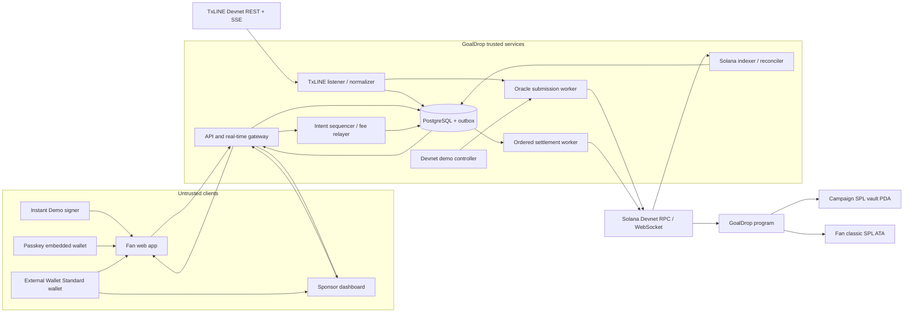
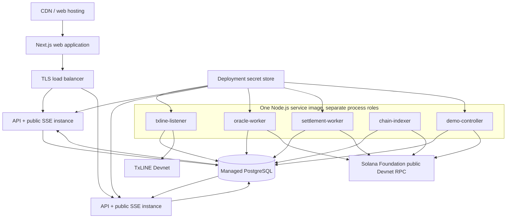
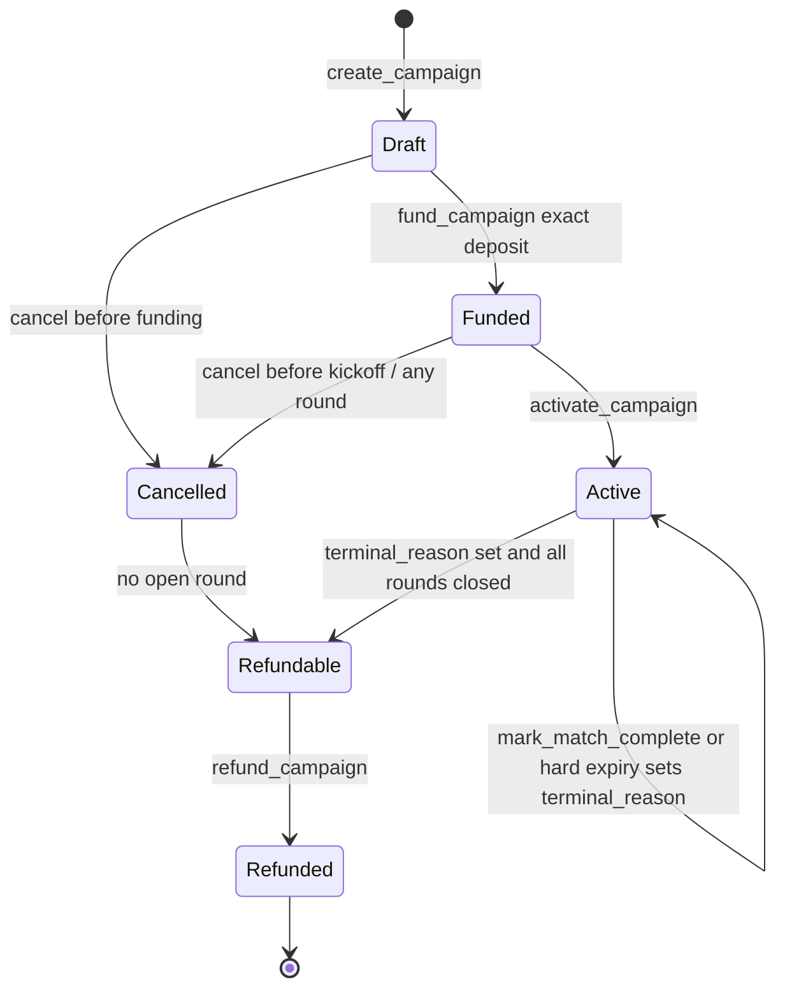
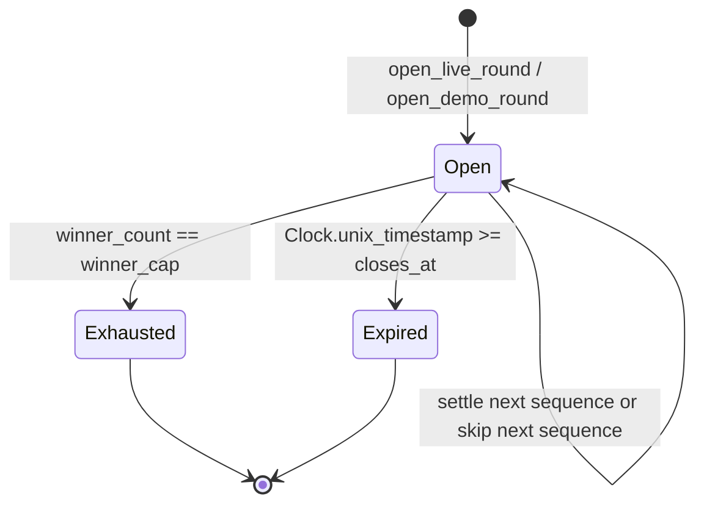
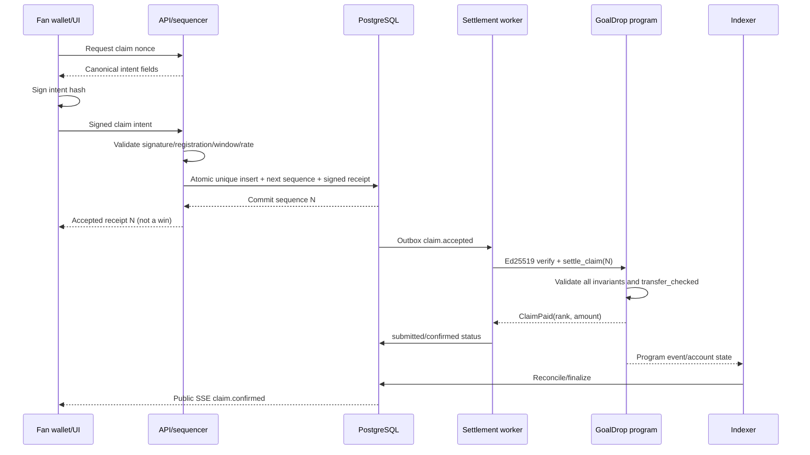

# GoalDrop — Devnet MVP Architecture

> **Status:** implementation architecture for the hackathon MVP<br>
> **Scope:** Solana Devnet only<br>
> **Product source:** [`PRD.md`](./PRD.md)<br>
> **Research source:** [`hackathon.md`](./hackathon.md) and the primary references linked below<br>
> **Architecture verified against public sources:** July 15, 2026

## 1. Purpose

This document defines the complete architecture required to build and demonstrate GoalDrop on Solana Devnet. It covers the fan and sponsor applications, TxLINE ingestion, gasless registration and claiming, trusted first-come sequencing, the GoalDrop Solana program, reward custody, real-time delivery, persistence, deployment, security, operations, and testing.

It is intentionally limited to the devnet MVP. It does not define a production Mainnet deployment, a public widget SDK, organization management, fiat features, swaps, NFTs, Token-2022 rewards, or on-chain validation of TxLINE Merkle proofs.

The architecture preserves the PRD's honest trust model:

- TxLINE is the sports-data source.
- The GoalDrop oracle is trusted to interpret TxLINE and open the correct round.
- The GoalDrop relayer is trusted to accept and order otherwise valid claim intents fairly.
- The Solana program independently enforces custody, registration deadlines, round windows, exact payouts, sequence progression, winner caps, duplicate prevention, finalization, and refunds.

### 1.1 Acceptance criteria

- [ ] The document names every runtime component needed for the sponsor-to-refund seam and identifies whether its truth is trusted, on-chain, or derived.
- [ ] An implementer can identify the product source, research source, Devnet boundary, and non-goals without consulting an undocumented decision.
- [ ] Every material custody, eligibility, ordering, timing, and finalization responsibility is assigned to exactly one authoritative component.
- [ ] A review against `PRD.md` finds no required MVP journey that lacks an architectural owner.

## 2. MVP outcome and hard boundaries

The deployed MVP must support this complete seam:

```text
TxLINE subscription and fixture discovery
→ sponsor campaign creation and exact funding
→ gasless fan registration
→ real or visibly synthetic goal ingestion
→ on-chain round opening
→ durable FCFS claim receipts
→ ordered on-chain SPL-token payouts
→ fan balance and transfer
→ match finalization and residual refund
```

The following boundaries are architectural, not merely UI choices:

| Boundary | Devnet MVP decision |
| --- | --- |
| Network | Solana Devnet only; every signed intent includes the devnet domain and deployed GoalDrop program ID. |
| GoalDrop program | One Devnet deployment with live-oracle and demo-oracle instructions. The program ID is set at deployment and is never inferred from TxLINE's program ID. |
| Reward asset | One operator-controlled classic SPL Token mint, configured on-chain. Token-2022 reward mints are rejected. |
| TxLINE subscription asset | TxLINE's Devnet TxL mint uses Token-2022 as required by TxLINE. This is separate from the GoalDrop reward mint. |
| Campaigns | Permissionless sponsor creation for eligible fixtures, but only the configured demo reward mint is accepted. |
| Fixture exclusivity | At most one non-refunded campaign reserves a normalized TxLINE fixture ID. |
| Goal semantics | First `goal` update for a stable action ID opens a round. Regulation, extra-time, and own goals qualify; shootout penalty outcomes do not. |
| Reversals | Amendments, discards, or VAR overturns are audited but never close a round or claw back a payout. |
| Claim order | Order of durable acceptance by the GoalDrop relayer, expressed as a round-scoped sequence. Browser click time is not authoritative. |
| Demo | Synthetic TxLINE-shaped events exercise the same campaign, vault, round, intent, relayer, and settlement paths as live events. |
| Public data | Browsers receive only the minimum derived fixture and campaign state. TxLINE credentials and raw provider payloads remain server-side. |

### 2.1 Acceptance criteria

- [ ] One deployed Devnet run completes TxLINE/demo input → campaign funding → registration → round open → ordered claim → SPL payout → finalization → refund.
- [ ] Service startup fails closed if any configured cluster, program, API host, mint, or network domain is not the documented Devnet value.
- [ ] The public build contains no Mainnet endpoint, Mainnet program ID, real-valued reward mint, or unlabeled demo event path.
- [ ] Token-2022 is used only for the TxLINE subscription asset; every GoalDrop reward-mint and reward-account test uses the classic Token Program.
- [ ] A duplicate goal, duplicate registration, duplicate claim, late claim, over-cap claim, and premature refund all fail deterministically in the complete seam.

## 3. Explicit assumptions

Work proceeds under these assumptions. A failed assumption requires the named fallback or a product change; it must not be silently ignored.

| ID | Assumption | Consequence or fallback |
| --- | --- | --- |
| A1 | TxLINE Devnet service level `1` remains enabled with a zero-second sampling interval during judging. | Query the on-chain pricing matrix during deployment. If unavailable, retain the real integration but use visibly labeled synthetic Demo Match Mode for judging. |
| A2 | TxLINE score stream `goal` records contain `fixtureId`, `id`, `seq`, `ts`, `confirmed`, `statusSoccerId`, and the documented soccer fields. | The adapter rejects malformed records and records a schema alert; it never guesses a goal from a score delta. |
| A3 | `(fixtureId, goal.id)` is stable across the unconfirmed and confirmed versions of one goal. | Both the database and an on-chain `GoalReceipt` PDA enforce this identity. If live samples contradict it, switch the adapter version and event-key function before any campaign is activated. |
| A4 | The selected passkey wallet exposes Solana Wallet Standard `solana:signMessage` and transaction signing for the tested browsers. | This is a release-blocking integration spike. If detached message signing is absent, the passkey provider cannot serve the gasless intent design and must be replaced; transaction-signing fallback is retained only for reward transfer. |
| A5 | The passkey provider issues a normal Ed25519 Solana public key whose signatures can be checked by Solana's Ed25519 precompile. | Verify on Devnet before UI implementation. No custom smart-wallet signature scheme is in MVP scope. |
| A6 | A single-region PostgreSQL primary can serialize a 500-request/five-second burst and durably acknowledge accepted claims below 500 ms p95. | Load test before the demo. Scale API instances horizontally but retain one database sequence row per round as the serialization point. |
| A7 | Individual settlement transactions can pay 100 winners within the two-minute on-chain window under Devnet conditions. | Benchmark on local validator and Devnet. A two-claim batch is a measured optimization only; it is not assumed to fit before serialization and compute tests. |
| A8 | A normal live campaign hard-expires eight hours after scheduled kickoff. | This covers regulation, extra time, shootout, and ordinary delays. A postponed or very long suspended fixture is refunded instead of following a rescheduled match. Demo campaigns use a shorter configured expiry. |
| A9 | Public display of the minimum derived fixture state needed for the hackathon is permitted. | Keep a deployment kill switch. The requester confirmed the required TxODDS permission is resolved; do not expose raw feeds, offer pass-through API access, or replay recorded TxLINE data publicly. |
| A10 | Raw TxLINE payload storage is permitted only for short-lived operational diagnosis during the hackathon. | Encrypt it, restrict access, delete it after 24 hours, and retain only a digest plus normalized decision metadata. Keep raw retention disabled unless the approved scope explicitly requires it. |
| A11 | Judges need a no-payment, no-extension, no-external-wallet path. | Ship a pre-funded campaign and a visibly labeled Devnet-only instant-demo signer generated in browser memory. The passkey and external-wallet paths remain the product paths and are shown in the video. |
| A12 | The Devnet reward token has six decimals, no freeze authority, no financial value, and conspicuous demo labeling. | All amounts are still stored in integer base units. The UI never uses a dollar sign or implies that the token is redeemable. |
| A13 | The pre-seeded Devnet demo campaign may use the operator wallet as sponsor, refund wallet, reward-mint authority, and fee payer. | This is limited to the valueless, operator-funded judge campaign. User-created sponsor campaigns still require their own sponsor signature, and Mainnet must split all four capabilities. |

### 3.1 Acceptance criteria

- [ ] Every assumption has a stable ID, a falsifiable proposition, and an explicit consequence or fallback.
- [ ] The release checklist records current evidence for A1–A13 and links each failed assumption to the invoked fallback or a release-blocking issue.
- [ ] No assumption overrides an on-chain invariant, hides a trusted boundary, or silently expands the architecture beyond Devnet.
- [ ] Changes to an assumption are reviewed as architecture changes and update affected tests, configuration, and traceability rows.
- [ ] The deployed UI labels all user-visible consequences of A8, A11, and A12: timeout policy, ephemeral demo signer, and valueless Devnet token.

## 4. Researched critical questions and adopted answers

### Q1. What is a stable TxLINE goal identity, and when should a drop open?

**Research.** The TxODDS soccer-feed specification says a goal has `Action = "goal"`, an action `Id`, a fixture-scoped update `Seq`, and a `Confirmed` flag. An unconfirmed event is closer to the action on the field; a later confirmation uses the same action ID. The same specification defines `action_amend` and `action_discarded`. A private, credentialed Devnet validation on July 16 parsed 21,757 records from 20 historical fixtures: every wire record used PascalCase, all 49 repeated goal IDs paired unconfirmed and confirmed records, and the sample contained 273 amendment/discard/VAR records. No licensed payload was persisted. See the [soccer feed page](https://txline.txodds.com/documentation/scores/soccer-feed) and the [Soccer Feed v1.1 PDF](https://txodds.github.io/tx-on-chain/assets/txodds-soccer-feed-v1.1.pdf).

**Suggested answer adopted.** Open on the first well-formed `goal` record, whether `confirmed` is false or true. Define:

```text
event_key = SHA256("txline-goal-v1" || fixture_id_u64_le || action_id_u64_le)
```

The first update wins the idempotency race. Later confirmation, amendment, VAR, and discard records update the audit trail only. This choice meets the real-time product goal and makes the PRD's no-clawback risk explicit.

### Q2. Which football events count as goals?

**Research.** TxODDS documents `goal` actions during first half, second half, and both extra-time halves. A goal can have `GoalType = Own`. Penalty-shootout scores are represented separately as penalty outcomes and have their own status/stat prefix. The documented goal statuses are H1, H2, ET1, and ET2. See the [soccer feed](https://txline.txodds.com/documentation/scores/soccer-feed).

**Suggested answer adopted.** Qualify `goal` records only when `statusSoccerId ∈ {2, 4, 7, 9}`. Include own goals. Exclude `possible`, score adjustments, and `penalty_outcome` records, including scored shootout penalties. A later score adjustment never manufactures a retroactive reward round.

### Q3. How should the listener recover without duplicating or missing goals?

**Research.** The official scores stream is SSE, supports `fixtureId` filtering and `Last-Event-ID`, emits IDs in `timestamp:index` form, and may be quiet even when the connection is healthy. Current-interval fixture updates and historical interval endpoints are also available. See the [streaming guide](https://txline.txodds.com/documentation/examples/streaming-data), [OpenAPI definition](https://txline.txodds.com/docs/docs.yaml), and [runnable Devnet score example](https://github.com/txodds/tx-on-chain/blob/main/examples/devnet/scripts/subscription_scores.ts).

**Suggested answer adopted.** Persist the last SSE ID and last fixture `seq`; reconnect with `Last-Event-ID`; reconcile the current five-minute fixture updates and any completed missing intervals; then resume the stream. A recovered goal no more than 60 seconds old may open a round. Older missed goals are recorded as `late_not_opened` and alert the operator rather than unexpectedly starting a reward race minutes later. Database uniqueness and the on-chain `GoalReceipt` make every retry safe.

### Q4. Should the GoalDrop program validate a TxLINE Merkle proof before opening a round?

**Research.** TxLINE exposes proofs for fixture and score-stat batches and anchors roots in its Solana program. The documented proof endpoints validate encoded statistics, not a low-latency semantic claim that a specific `goal` action should irrevocably open a consumer reward window. Proof retrieval and verification also add payload and compute cost. See the [scores overview](https://txline.txodds.com/documentation/scores/overview) and [on-chain validation guide](https://txline.txodds.com/documentation/examples/onchain-validation).

**Suggested answer adopted.** Do not verify TxLINE proofs inside the MVP GoalDrop program. The authorized oracle signs the normalized goal decision, while the raw digest, provider fields, and transaction signature form the audit trail. Proof verification remains outside Devnet MVP scope, matching the PRD.

### Q5. How can registration and claiming be gasless without trusting the browser?

**Research.** Solana exposes a native Ed25519 signature-verification precompile, and programs can inspect the transaction's instruction sysvar to bind a verified message to program logic. The passkey SDK advertises a Solana Wallet Standard provider; its public documentation also describes recovery, multi-device behavior, and key export. See [Solana precompiles](https://solana.com/docs/core/programs/precompiles), the [Passkeys Solana provider](https://passkeys.foundation/docs/api-reference/create-wallet), and [Passkeys FAQ](https://passkeys.foundation/docs/faq).

**Suggested answer adopted.** The fan signs a short, deterministic, domain-separated intent digest. The relayer pays the fee and creates the transaction containing an Ed25519 verification instruction followed immediately by the GoalDrop instruction. The program recomputes the digest and inspects the verification instruction. The fan never needs SOL and the relayer cannot change campaign, round, wallet, recipient, nonce, or expiry after signing. Devnet uses the provider's sandbox/default configuration without an App ID; `NEXT_PUBLIC_PASSKEY_APP_ID` becomes mandatory only when `NEXT_PUBLIC_DEPLOYMENT_TIER=production`, and the production build fails closed if it is missing.

### Q6. How should first-come ordering interact with Solana limits and contention?

**Research.** Solana transactions are capped at 1,232 bytes; signature precompiles, account addresses, claim PDAs, recipient token accounts, and token transfers consume that budget. Transactions that write the same round and vault accounts contend by design. Fees are charged even on failed transactions. See [transaction limits](https://solana.com/docs/core/transactions), [program execution](https://solana.com/docs/core/programs/program-execution), and [fee structure](https://solana.com/docs/core/fees/fee-structure).

**Suggested answer adopted.** Serialize acceptance in PostgreSQL and settlement in the Round PDA. The baseline is one claim per transaction with a small submission pipeline and deterministic retry of out-of-order failures. Do not commit to a large batch. Test an optional two-claim batch only if it fits the serialized transaction and compute budget. This keeps the implementation understandable and auditable while still absorbing the HTTP burst immediately.

### Q7. What may the public application expose or replay?

**Research.** The hackathon requires a deployed consumer product but the official terms also prohibit redistribution, publication, sharing, or making TxODDS Data available and terminate the hackathon data licence at the hackathon's conclusion. This conflict required sponsor clarification. See the [hackathon terms](https://txline.txodds.com/documentation/legal/hackathon-terms) and [`hackathon.md`](./hackathon.md).

**Suggested answer adopted.** Keep all TxLINE credentials and raw payloads in the trusted backend. Expose only minimal derived match identity, phase, score, and GoalDrop state needed by the experience. Use synthetic TxLINE-shaped demo events, not recorded public replay, unless the confirmed permission expressly covers replay. Keep independent `TXLINE_LISTENER_ENABLED`, `TXLINE_PUBLIC_OUTPUT_ENABLED`, and `TXLINE_RAW_RETENTION_ENABLED` kill switches and a post-hackathon shutdown runbook. The requester confirmed the required permission is resolved for the Devnet MVP; retain only secret-redacted evidence of that disposition.

### Q8. How can a judge test without buying tokens or establishing an external wallet?

**Research.** The hackathon terms require judges to evaluate a submission without payment, token purchases, or creating an external blockchain wallet/account. The track also expects Solana-backed behavior and a reliable demo path. See the [track listing](https://superteam.fun/earn/listing/consumer-and-fan-experiences) and [hackathon terms](https://txline.txodds.com/documentation/legal/hackathon-terms).

**Suggested answer adopted.** Deploy a pre-funded demo campaign. "Instant Demo" generates one Ed25519 signer per browser profile, persists its 32-byte seed in origin-scoped browser storage, registers it gaslessly, and uses the real claim path. This keeps one address across tabs and reloads so rewards remain visible throughout judging. Disconnect marks the stored signer inactive without rotating it; an explicit, warned Reset action or clearing site data deletes it. The UI labels it Devnet-only, browser-saved, unsuitable for real assets, and unavailable in production-tier builds. It has no backup or cross-browser recovery. The normal fan path uses a passkey; the external-wallet sponsor and fan paths remain available. This avoids making the judge acquire SOL or install a wallet while preserving real on-chain settlement.

### Q9. What final event and timeout make funds refundable?

**Research.** TxLINE documents `game_finalised` as the final score action and documents interrupted, abandoned, cancelled, coverage-cancelled, suspended, and postponed soccer phases. The private authenticated July 16 sample contained 20 `game_finalised` records: 17 carried `StatusId = 100`, three omitted `StatusId`, and all omitted `Period`. This contradicts the earlier assumption that both `statusId = 100` and `period = 100` are always present. See the [scores overview](https://txline.txodds.com/documentation/scores/overview).

**Suggested answer adopted.** The oracle marks the campaign complete upon a well-formed `game_finalised` action. If `StatusId` or `Period` is present it must equal `100`; absence is accepted, while a contradictory value is rejected. It may also mark an explicit terminal cancellation/abandonment after recording the provider state. Independently, anyone may finalize after `hard_expiry`, defaulting to scheduled kickoff plus eight hours. Every open round must first be exhausted or expired. A postponed fixture does not carry the campaign to a new date in the MVP.

### Q10. Can the Devnet MVP use a sponsor token without expanding into regulated wagering or prize-promotion scope?

**Research.** The official hackathon terms require compliance with applicable gambling, financial, consumer-protection, sanctions, privacy, and other laws, and the product brief does not waive those obligations. The PRD already excludes paid entry, predictions, wagering, swaps, and fiat conversion. See the [hackathon terms](https://txline.txodds.com/documentation/legal/hackathon-terms) and the compliance analysis in [`hackathon.md`](./hackathon.md).

**Suggested answer adopted.** The public Devnet deployment uses only a conspicuously labeled, freely minted, nonredeemable test token with no represented monetary value. Joining is free; success depends only on valid first-come submission after a goal; there is no stake, purchase, prediction, random draw, swap, or cash-out. Campaign copy must call it a Devnet demonstration reward, not money or a guaranteed prize. Any economically valuable sponsor token or jurisdiction-targeted promotion is outside this architecture and requires written legal/compliance approval before implementation.

### 4.11 Acceptance criteria

- [ ] Each critical question Q1–Q10 contains a concrete question, cited research, and one adopted answer that downstream implementation can test.
- [ ] Synthetic adapter tests prove the adopted goal identity, qualifying statuses, own-goal inclusion, shootout exclusion, correction behavior, recovery window, and finalization marker.
- [ ] Program and integration tests prove the adopted Ed25519 intent design, trusted oracle boundary, ordered individual settlement, and hard-timeout behavior.
- [ ] Deployment evidence proves public output minimization, synthetic demo labeling, and use of a valueless classic SPL test token.
- [ ] If live TxLINE samples or written sponsor guidance contradict an adopted answer, activation remains disabled until this section, its versioned adapter/protocol, and affected tests are updated.

## 5. System context



### 5.1 Trust boundaries

| Component | Trusted capability | Program-enforced limit |
| --- | --- | --- |
| TxLINE adapter/oracle | Classifies provider records and chooses when a live goal is real enough to open. | Only the configured oracle can call `open_live_round`; one event hash opens at most one round. |
| Demo controller | Creates synthetic goal events on Devnet. | Only the configured demo authority can call `open_demo_round`; every demo round is marked on-chain. |
| Relayer/sequencer | Accepts requests, assigns receipt sequences, and can explicitly skip an unprocessable sequence. | Fan signature, registration, window, exact sequence, one-claim PDA, cap, amount, vault, and recipient are all checked. Skips emit an on-chain audit event and do not consume a winner rank. |
| Fee payer | Pays fees and account rent. | It has no vault authority and cannot transfer sponsor rewards by itself. |
| Admin | Rotates operational authorities and pause flags. | It cannot change activated economics, redirect a refund, debit a vault, or reopen a closed round. |
| Passkey provider | Creates/recovers the fan key and signs at user request. | Solana verifies the Ed25519 signature associated with the registered public key. |
| PostgreSQL | Defines accepted-request order and holds projections/audit metadata. | It cannot exceed on-chain caps or transfer tokens without authorized signed transactions. |

### 5.2 Acceptance criteria

- [ ] Every node and arrow in the context diagram maps to a deployed component, named protocol, credential boundary, or documented external dependency.
- [ ] Browser network inspection confirms that clients communicate only with the public API, wallet provider, and approved Solana endpoints—not TxLINE authenticated endpoints or worker interfaces.
- [ ] Separate keys prove that the live oracle, demo authority, relayer, fee payer, admin, and TxLINE subscriber cannot substitute for one another.
- [ ] A database administrator without an authorized Solana key cannot create a winner, move vault tokens, or redirect a refund.
- [ ] A malicious relayer test demonstrates that program caps, signatures, recipient binding, and Claim PDAs still hold, while the documented censorship/reordering trust limitation remains visible.

## 6. Deployable architecture

Use a small modular monolith, split into process types rather than independent microservices. This reduces operational overhead while retaining independent failure and scaling boundaries.



### 6.1 Recommended technology choices

| Area | Choice | Why it fits the MVP |
| --- | --- | --- |
| Web | TypeScript, React, Next.js App Router | One responsive codebase for sponsor, fan, demo, and mocked partner shell; server rendering for initial state and client rendering for the live experience. |
| Public API | Node.js TypeScript with Fastify or equivalent schema-first HTTP framework | Low overhead, explicit request limits, good SSE support, and shared protocol types with the web app. |
| Workers | Same Node.js codebase with distinct commands/process roles | Reuses TxLINE, Solana, database, and observability packages while keeping long-lived SSE work out of serverless functions. |
| Database | Managed PostgreSQL | Durable transactions, row locking, uniqueness, an outbox, advisory locks, and sufficient burst throughput without Redis in the MVP. |
| Program | Rust with Anchor, using `anchor_spl::token` for the classic Token Program | Strong account validation and efficient PDA/CPI development. Use the classic `Program<Token>`, not the token interface, so Token-2022 reward accounts are rejected. |
| Solana client | `@solana/web3.js`/Anchor client matching the selected Anchor release | Matches TxLINE's runnable examples and allows explicit Ed25519, compute-budget, and sponsored-transaction construction. |
| Wallets | Solana Wallet Standard plus Passkeys Developer Kit after the signing spike | One adapter surface for embedded and external wallets. |
| Testing | Anchor tests, Rust unit/property tests, local validator, API contract tests, Playwright, and k6 | Covers program invariants, integration seams, UX, and the burst target. |

**Devnet toolchain decision.** Anchor 0.32.1 with its verified Agave 2.3 SBF build path is the authoritative program-build toolchain. The machine's global Solana CLI 4.1.2 may be used for wire-compatible Devnet RPC, account inspection, and deployment commands, but it must not silently rebuild or replace the pinned SBF artifact. Release evidence records the exact deployed byte length and SHA-256, so a newer global CLI is acceptable only when the on-chain bytes still match that artifact. This avoids coupling reproducible program compilation to an unrelated global CLI upgrade while preserving a current operational CLI.

Do not run the TxLINE listener or settlement worker in request-scoped serverless functions. Both need durable cursors, controlled concurrency, and long-lived connections.

### 6.2 Acceptance criteria

- [ ] Deployment manifests create separate process roles for public API/SSE, TxLINE listener, oracle, settlement, indexer, and demo controller from the shared service image.
- [ ] Restarting or scaling an API instance does not reset TxLINE cursors, round sequences, settlement status, or public event replay.
- [ ] Only the TxLINE listener holds TxLINE credentials; only the process role needing an authority receives that authority's secret.
- [ ] Public ingress exposes only the versioned public API/SSE routes; `/internal/health` and `/internal/metrics` remain reachable only from the hosting platform and observability network.
- [ ] API and PostgreSQL are deployed in one measured region, and the 500-request load test runs against that actual topology.
- [ ] Long-lived TxLINE and Solana WebSocket connections survive the hosting platform's idle limits or reconnect through the documented recovery path.
- [ ] The web deployment, service deployment, database migration, and worker commands are reproducible from version-controlled configuration with no manual secret copying.

## 7. Solana Devnet program

### 7.1 Program responsibility

The GoalDrop program is the economic and eligibility authority. It does not fetch TxLINE, decide sports truth, render a rank from an off-chain database, or custody embedded-wallet keys.

The program must:

- configure Devnet authorities and the single allowed reward mint;
- reserve one active campaign per fixture;
- calculate and store immutable round economics;
- create a program-authorized classic SPL vault;
- require exact sponsor funding through the program;
- record one registration per campaign and wallet before the deadline;
- open one next round per unique authorized goal event;
- verify fan-signed intents using the Ed25519 precompile;
- enforce contiguous receipt sequence processing, with explicit audited skips;
- create one Claim PDA per successful wallet/round pair;
- transfer the exact reward through `transfer_checked`;
- close expired rounds permissionlessly;
- prevent refund while a round is open or a campaign is not terminal;
- refund the entire residual vault balance to the immutable refund wallet; and
- emit events for projection and audit.

### 7.2 Program constants

```text
PROGRAM_VERSION = 1
NETWORK_DOMAIN = SHA256("solana:devnet")
MAX_ROUNDS = 8
ROUND_DURATION_SECONDS = 120
MAX_WINNERS_PER_ROUND = 100
MAX_REWARD_AMOUNT = deployment-configured safety bound
CLASSIC_TOKEN_PROGRAM = TokenkegQfeZyiNwAJbNbGKPFXCWuBvf9Ss623VQ5DA
```

`MAX_REWARD_AMOUNT` is a defense-in-depth cap in base units. Campaign required funding is accumulated in `u128`, checked against the cap and `u64::MAX`, then stored as `u64`.

Serialized discriminants and flags are stable protocol values:

```text
CampaignState: Draft=0, Funded=1, Active=2, Cancelled=3,
               Refundable=4, Refunded=5
TerminalReason: None=0, ProviderFinalised=1, ProviderCancelled=2,
                ProviderAbandoned=3, HardTimeout=4
RoundState: Open=0, Exhausted=1, Expired=2
RoundSource: Live=0, Demo=1
PauseMask: CAMPAIGN_WRITES=0x0001, REGISTRATION=0x0002,
           ROUND_OPEN=0x0004, SETTLEMENT=0x0008
SkipReason: InvalidAfterAcceptance=1, RecipientAccountFailure=2,
            PermanentProgramMismatch=3, OperatorIncident=255
```

Adding a value is a versioned protocol change. Reusing or renumbering a value is forbidden.

### 7.3 PDA and account model

| Account | PDA seeds | Important fields | Created/payer | Closed |
| --- | --- | --- | --- | --- |
| `PlatformConfig` | `['config']` | version, admin, oracle, relayer, demo authority, reward mint, network domain, pause mask, authority epoch | deployer/admin | never in MVP |
| `FixtureSlot` | `['fixture', fixture_id_le]` | fixture ID, active campaign, reserved_at | sponsor/fee payer | after campaign refund |
| `Campaign` | `['campaign', sponsor, campaign_nonce_le]` | sponsor, fixture, mint, refund wallet, dates, state, round configs, funding/paid/refunded/external-inflow totals, next round, open-round count | sponsor/fee payer | retained for audit |
| `Vault` token account | `['vault', campaign]` | classic SPL account; mint = reward mint; authority = Campaign PDA | sponsor/fee payer | atomically after residual refund |
| `Round` | `['round', campaign, ordinal_u8]` | source, event hash, provider metadata, open/close time, amount, cap, winner count, next sequence, skipped count, paid total, state | oracle/fee payer | retained for audit |
| `GoalReceipt` | `['goal', campaign, event_hash_32]` | source, round ordinal, provider action ID/seq/timestamp, opened_at | oracle/fee payer | retained for audit |
| `Registration` | `['registration', campaign, fan_wallet]` | fan wallet, registered_at, intent hash | relayer/fee payer | retained through demo |
| `Claim` | `['claim', round, fan_wallet]` | wallet, recipient, sequence, winner rank, amount, intent hash, paid_at | relayer/fee payer | retained through demo |

The vault is a seeded token-account PDA rather than the Campaign PDA's associated token account. Closing it after refund prevents arbitrary recreation at the same address without the GoalDrop program's PDA signature.

#### 7.3.1 Fixed account layouts and space budgets

All protocol accounts are fixed-size Borsh layouts with an 8-byte Anchor discriminator. Enums are explicitly serialized as `u8`; optional timestamps use `0` as unset rather than a variable-size `Option`. Every account begins with `version` and `bump`, and every reserved byte is initialized to zero. These are the implementation budgets, not estimates:

```rust
struct PlatformConfig {                 // data 232; Anchor space 240
    version: u8,
    bump: u8,
    pause_mask: u16,
    authority_epoch: u32,
    admin: Pubkey,
    oracle: Pubkey,
    relayer: Pubkey,
    demo_authority: Pubkey,
    reward_mint: Pubkey,
    network_domain: [u8; 32],
    reward_decimals: u8,
    reserved: [u8; 31],
}

struct FixtureSlot {                    // data 64; Anchor space 72
    bump: u8,
    fixture_id: u64,
    campaign: Pubkey,
    reserved_at: i64,
    reserved: [u8; 15],
}

struct RoundConfig {                    // data 16
    reward_amount: u64,
    winner_cap: u16,
    reserved: [u8; 6],
}

struct Campaign {                       // data 416; Anchor space 424
    version: u8,
    bump: u8,
    vault_bump: u8,
    state: u8,
    round_count: u8,
    next_round: u8,
    open_round_count: u8,
    terminal_reason: u8,
    sponsor: Pubkey,
    fixture_slot: Pubkey,
    fixture_id: u64,
    reward_mint: Pubkey,
    refund_wallet: Pubkey,
    scheduled_start: i64,
    registration_deadline: i64,
    expected_end: i64,
    hard_expiry: i64,
    created_at: i64,
    activated_at: i64,
    match_complete_at: i64,
    campaign_nonce: u64,
    required_funding: u64,
    funded_amount: u64,
    paid_amount: u64,
    refunded_amount: u64,
    external_inflow_total: u128,
    rounds: [RoundConfig; 8],
    reserved: [u8; 32],
}

struct Round {                          // data 208; Anchor space 216
    version: u8,
    bump: u8,
    state: u8,
    source: u8,
    ordinal: u8,
    reserved_header: [u8; 3],
    campaign: Pubkey,
    goal_receipt: Pubkey,
    event_hash: [u8; 32],
    provider_action_id: u64,
    provider_seq: u32,
    provider_status: u16,
    reserved_provider: [u8; 2],
    provider_ts_ms: i64,
    opened_at: i64,
    closes_at: i64,
    reward_amount: u64,
    winner_cap: u16,
    winner_count: u16,
    next_sequence: u64,
    skipped_count: u32,
    paid_total: u64,
    reserved: [u8; 32],
}

struct GoalReceipt {                    // data 160; Anchor space 168
    version: u8,
    bump: u8,
    source: u8,
    round_ordinal: u8,
    campaign: Pubkey,
    event_hash: [u8; 32],
    provider_action_id: u64,
    provider_seq: u32,
    provider_status: u16,
    confirmed_at_open: u8,
    reserved_header: u8,
    provider_ts_ms: i64,
    opened_at: i64,
    raw_digest: [u8; 32],
    reserved: [u8; 28],
}

struct Registration {                   // data 120; Anchor space 128
    version: u8,
    bump: u8,
    campaign: Pubkey,
    wallet: Pubkey,
    registered_at: i64,
    intent_hash: [u8; 32],
    reserved: [u8; 14],
}

struct Claim {                          // data 192; Anchor space 200
    version: u8,
    bump: u8,
    winner_rank: u16,
    campaign: Pubkey,
    round: Pubkey,
    wallet: Pubkey,
    recipient: Pubkey,
    sequence: u64,
    amount: u64,
    paid_at: i64,
    intent_hash: [u8; 32],
    reserved: [u8; 4],
}
```

Use compile-time space constants and serialization golden tests; do not duplicate hand-written space arithmetic inside instruction contexts. The classic SPL Vault itself uses the Token Program's fixed token-account layout. At deployment, calculate the current rent-exempt lamports for every size through RPC and budget the fee payer for 1,000 Registrations, 800 Claims across eight full rounds, Round/GoalReceipt accounts, ATAs, and failed-transaction fees. Rent figures are not hard-coded in this document because cluster rent parameters are runtime data.

Only `round_count` entries are active. Unused fixed entries are zeroed. Creating Round PDAs lazily when goals occur avoids paying rent for unplayed rounds.

### 7.4 Campaign state machine



`Live`, `registration closed`, `terminal`, and `exhausted` are derived presentation states, not extra stored campaign states. `terminal_reason != None` makes an Active campaign terminal until `make_refundable` changes the stored state. `hard_expiry` can set that reason without oracle cooperation. No goal instruction is valid once the terminal reason is set or the hard expiry has passed.

Campaign creation enforces these time and economics bounds against Solana Clock:

```text
now < registration_deadline <= scheduled_start
scheduled_start < expected_end < hard_expiry
hard_expiry <= scheduled_start + 24 hours
1 <= round_count <= 8
1 <= winner_cap_i <= 100
1 <= reward_amount_i <= MAX_REWARD_AMOUNT
```

The dashboard proposes `registration_deadline = scheduled_start`, `expected_end = scheduled_start + 3 hours`, and `hard_expiry = scheduled_start + 8 hours`. The wider 24-hour program bound allows a deliberately configured demo or delayed fixture without allowing indefinite fund lock.

### 7.5 Round and settlement state



Each round has an independent timer and sequence, so multiple rounds may be open concurrently. Campaign `open_round_count` is incremented at open and decremented exactly once on exhaustion or permissionless expiry.

### 7.6 Instruction set

| Instruction | Required signer | Main checks and effects |
| --- | --- | --- |
| `initialize_config` | deployer/admin | One-time initialization; stores Devnet network domain, separate authorities, classic reward mint, and version. |
| `set_pause_mask` | admin | Changes only pause bits. Close, terminal finalization, and refund are never pausable. |
| `rotate_authority` | admin | Rotates one operational role and increments authority epoch; emits old/new keys. Do not rotate relayer mid-round except during an incident. |
| `create_campaign` | sponsor | Validates fixture/time bounds, reward mint and Token Program, nonzero configs, maximums, checked required funding; initializes Campaign, FixtureSlot, and Vault. |
| `fund_campaign` | sponsor | Requires Draft, zero recorded funding, sponsor source account and exact `required_funding`; performs `transfer_checked`; stores Funded. |
| `activate_campaign` | sponsor | Requires Funded, vault solvency, future hard expiry, immutable config, and unpaused campaign activation; stores Active. Devnet has no sponsor allowlist. |
| `cancel_campaign` | sponsor | Only before scheduled kickoff, match completion, and any opened round; moves to Cancelled/Refundable. |
| `register_fan` | relayer plus verified fan message | Requires Active, on-chain time at or before deadline, correct registration digest, unique Registration PDA, and unpaused registration. Relayer pays rent/fee. |
| `open_live_round` | oracle | Requires Active, before hard expiry, a remaining configured round, unique GoalReceipt, source `Live`, matching fixture metadata, and unpaused opening. Initializes GoalReceipt/Round. |
| `open_demo_round` | demo authority | Same economic path but source `Demo`; provider IDs are replaced by a demo nonce/hash; on-chain event is permanently labeled demo. |
| `settle_claim` | relayer plus verified fan message | Requires Open and unexpired round, exact next sequence, valid registration/intent/recipient, unique Claim PDA, remaining cap, solvent vault; transfers exact amount, increments sequence and winner count, emits rank. |
| `skip_sequence` | relayer | Requires Open, exact next sequence, intent hash and bounded reason code; increments sequence/skipped count without winner count and emits an audit event. Used only after a sequenced request is deterministically unprocessable. |
| `close_round` | anyone | If Open and expired, sets Expired and decrements campaign open-round count. Idempotent client behavior; a second call fails harmlessly. |
| `mark_match_complete` | oracle | Records provider terminal metadata and completion time; prevents further rounds. Does not close an open round. |
| `finalize_after_timeout` | anyone | After hard expiry, records timeout completion and prevents further rounds. |
| `make_refundable` | anyone | Requires Cancelled or terminal campaign and zero open rounds; moves to Refundable. |
| `refund_campaign` | anyone, fixed destination | Syncs unsolicited inflow, transfers the full vault amount to the immutable refund wallet's classic ATA, closes the vault, stores refunded amount, and sets Refunded. Caller cannot choose the destination. |
| `release_fixture_slot` | anyone | Requires Refunded; closes FixtureSlot to the immutable refund wallet so another Devnet campaign may later use the fixture. Campaign history remains. |

The program emits stable versioned events; the indexer keys each by `(signature, instruction_index, event_index)`:

| Event | Minimum payload |
| --- | --- |
| `CampaignCreated` | version, campaign, fixture ID, sponsor, mint, required funding, round count |
| `CampaignFunded` | campaign, deposited amount, vault |
| `CampaignActivated` | campaign, activated_at, registration deadline, hard expiry |
| `FanRegistered` | campaign, wallet, registered_at, intent hash |
| `RoundOpened` | campaign, round, ordinal, live/demo source, event hash, opened_at, closes_at, reward, cap |
| `ClaimPaid` | campaign, round, wallet, sequence, winner rank, amount, intent hash |
| `SequenceSkipped` | campaign, round, sequence, intent hash, reason code |
| `RoundClosed` | campaign, round, Exhausted/Expired, winners, paid total, skipped count |
| `MatchCompleted` | campaign, terminal reason, provider action/seq, completed_at |
| `CampaignRefundable` | campaign, paid amount, residual balance |
| `CampaignRefunded` | campaign, refund wallet, token amount, vault-closure recipient |
| `AuthorityRotated` / `PauseChanged` | authority epoch, role/mask, old value, new value |

Event payloads are audit hints, not substitutes for fetching the referenced accounts.

### 7.7 Canonical fan intent

The browser signs the SHA-256 digest of this fixed binary payload. All integers are little-endian; public keys are raw 32-byte values; no JSON, locale, or Base58 rendering participates in the digest.

```text
domain_tag      [16]  = "GOALDROP_V1\0\0\0\0\0"
network_domain  [32]  = SHA256("solana:devnet")
program_id      [32]
action          u8    = 1 register | 2 claim
campaign        [32]
round           [32]  = zeroes for registration
wallet          [32]
recipient       [32]  = wallet for MVP
nonce           [16]  = cryptographically random server challenge
expires_at      i64
```

```text
intent_hash = SHA256(canonical_payload)
fan_signature = Ed25519Sign(fan_private_key, intent_hash)
```

The API returns both the canonical fields and a human-readable preview before the wallet prompt. The program reconstructs the payload and requires:

1. The immediately preceding instruction is the Ed25519 precompile.
2. It verifies exactly one inline signature.
3. Its public key equals `wallet`.
4. Its message is exactly the 32-byte `intent_hash` recomputed by GoalDrop.
5. The current Clock is no later than `expires_at` and the relevant registration/round deadline.
6. `recipient == wallet`; rewards cannot be redirected by the relayer.

The instruction parser rejects cross-instruction offsets and unexpected layouts rather than trusting a generic "verification succeeded" signal.

### 7.8 Claim sequencing and signed receipt

The relayer receipt is not proof of winning. It proves only durable acceptance order.

```text
receipt_payload = {
  version,
  authority_epoch,
  network_domain,
  program_id,
  campaign,
  round,
  wallet,
  intent_hash,
  sequence,
  accepted_at_ms,
  receipt_id
}

receipt_signature = Ed25519Sign(relayer_key, SHA256(canonical_receipt_payload))
```

Round sequences start at `1`. `settle_claim` succeeds only when `sequence == round.next_sequence`. It increments the sequence only after every validation and token transfer succeeds. An out-of-order transaction fails and is retried. `skip_sequence` is the only valid way to advance without a payout and therefore makes an exceptional relayer decision public.

Winner rank is `winner_count + 1` at successful transfer time. Receipt sequence and winner rank can differ if a preceding sequence was explicitly skipped. Claims after the cap retain their signed receipts but are marked `missed` off-chain once the Round is Exhausted.

### 7.9 SPL token custody and accounting

GoalDrop rewards use only the original SPL Token Program. `create_campaign` requires:

- the Mint account is owned by the classic Token Program;
- the mint matches `PlatformConfig.reward_mint`;
- its decimals match the configured value;
- the vault is a GoalDrop PDA token account with `mint = reward_mint` and `authority = Campaign PDA`;
- every fan destination is the canonical classic ATA for `(fan_wallet, reward_mint)`.

Payout uses `transfer_checked` with Campaign PDA signer seeds. The relayer may prepend idempotent ATA creation in the same transaction; it pays rent.

Required funding is:

```text
required_funding = Σ(reward_amount_i × winner_cap_i)
```

The program performs multiplication and summation in checked `u128`, then verifies the result fits `u64`. The sponsor funds exactly this recorded amount through `fund_campaign`.

Anyone can send additional tokens to any existing SPL token account, so the program cannot prevent unsolicited vault deposits. It therefore maintains `external_inflow_total` as `u128`, while individual SPL balances and transfers remain `u64`. Before every payout and refund it compares the actual vault balance with the checked `u128` expression:

```text
expected_balance = funded_amount + external_inflow_total
                 - paid_amount - refunded_amount
```

If actual balance is higher, the positive difference is recorded as a new external inflow. If it is lower, the instruction fails with `VaultAccountingDeficit`. The auditable invariant is:

```text
funded_amount + external_inflow_total
  = paid_amount + refunded_amount + current_vault_balance
```

Refund transfers all remaining tokens, including unsolicited excess, to the immutable refund wallet and closes the vault atomically.

### 7.10 Hard on-chain invariants

1. One FixtureSlot points to at most one non-refunded campaign.
2. Activated fixture, sponsor, mint, refund wallet, deadlines, hard expiry, round count, reward amounts, and winner caps never change.
3. One Registration PDA exists per campaign/wallet.
4. One Claim PDA exists per round/wallet.
5. One GoalReceipt PDA exists per campaign/event hash.
6. Only oracle authority opens live rounds; only demo authority opens demo rounds.
7. A campaign opens rounds strictly in configured ordinal order and never more than `round_count`.
8. `closes_at = opened_at + 120 seconds` and a closed round never reopens.
9. Settlement sequence advances only by a successful exact payout or an explicit relayer skip.
10. Successful winners never exceed the configured cap.
11. Every successful winner receives exactly the configured amount in the configured mint.
12. The vault authority is the Campaign PDA and no campaign can spend another vault.
13. A campaign with any open round cannot become Refundable.
14. A nonterminal campaign cannot refund.
15. Refund destination is immutable and the caller cannot substitute an account.
16. Close/finalize/refund remain possible during a platform pause.
17. Demo origin is permanently visible in the Round and emitted event.

### 7.11 Acceptance criteria

- [ ] The deployed program ID and `PlatformConfig.network_domain` resolve only to Solana Devnet, and the initialized reward mint is owned by the classic Token Program.
- [ ] Serialization golden tests confirm every discriminator, enum value, PDA seed, fixed account size, canonical intent digest, and canonical receipt digest in this section.
- [ ] The complete instruction set deploys and each instruction enforces its documented signer, state, time, account, mint, arithmetic, and idempotency constraints.
- [ ] Property and concurrency tests prove all 17 hard invariants, including duplicate prevention, exact contiguous sequences, explicit skips, cap safety, immutable economics, and permissionless timeout/refund.
- [ ] A Token-2022 reward mint/account, wrong ATA, wrong vault, forged Ed25519 layout, wrong network domain, and unauthorized live/demo authority are rejected.
- [ ] Eight rounds, 100 winners per round, 1,000 registrations, overlapping open rounds, unsolicited vault inflow, cancellation, hard timeout, and full residual refund execute without accounting drift.
- [ ] `funded + external_inflows = paid + refunded + vault_balance` holds in checked `u128` after every tested instruction boundary.
- [ ] Program events contain the documented versioned payloads and are sufficient for the indexer to rebuild every public economic state without trusting logs as the final source of truth.

## 8. Off-chain services

### 8.1 API and real-time gateway

Responsibilities:

- serve public campaign, fixture, round, and receipt projections;
- issue bounded, one-time registration and claim nonces;
- validate request shape, origin, rate limits, wallet signatures, and current projection before sequencing;
- return signed receipts and status transitions;
- build sponsor and token-transfer transactions with the platform as optional Devnet fee payer;
- expose resumable application SSE to browsers;
- never return TxLINE credentials or raw provider payloads.

The public application SSE is not a pass-through of TxLINE. It emits GoalDrop domain events with monotonically increasing database IDs:

```text
campaign.updated
goal.detected
round.opened
round.exhausted
round.expired
claim.accepted
claim.submitted
claim.confirmed
claim.missed
campaign.refundable
campaign.refunded
service.degraded
```

On reconnect, the browser sends its last application event ID. If the retained event range is insufficient, it rehydrates the full campaign projection before resuming.

### 8.2 TxLINE subscription manager

TxLINE setup is an operator workflow, not a browser workflow. All values come from the Devnet row:

| Setting | Devnet value |
| --- | --- |
| TxLINE API origin | `https://txline-dev.txodds.com` |
| TxLINE Solana program | `6pW64gN1s2uqjHkn1unFeEjAwJkPGHoppGvS715wyP2J` |
| TxL Token-2022 mint | `4Zao8ocPhmMgq7PdsYWyxvqySMGx7xb9cMftPMkEokRG` |
| Default service level | `1`, after verifying the current `pricing_matrix` PDA |
| Duration | four weeks |
| Selected leagues | empty standard World Cup bundle list |

The activation script follows the [World Cup free-tier flow](https://txline.txodds.com/documentation/worldcup): obtain a guest JWT, submit `subscribe`, sign `${txSig}::${jwt}` with the same operator wallet, activate the API token, and put the token plus operator configuration in the deployment secret store.

The listener renews a guest JWT on `401`, treats `403` as an entitlement/network incident, and never logs either credential. The operator subscription key is distinct from every GoalDrop program authority.

### 8.3 TxLINE listener and normalizer

For each active live campaign:

1. Load a server-side fixture snapshot for metadata.
2. Load the latest score snapshot to hydrate current phase and score.
3. Open `/api/scores/stream?fixtureId={fixtureId}` with both required auth headers and the last SSE ID.
4. Parse SSE framing, normalize the authenticated PascalCase wire envelope to the pinned internal camelCase schema, ignore heartbeat/unsupported actions, and reject malformed semantic records.
5. Store provider cursor, raw digest, normalized metadata, and decision in one database transaction.
6. For a qualifying goal, insert `goal_decision` under the unique event key and enqueue an oracle command through the outbox.
7. For confirmation/amend/discard/VAR, append audit metadata without changing an opened round.
8. For `game_finalised`, enqueue match completion when optional `StatusId` and `Period` are absent or `100`; reject contradictory markers and record a schema/semantic alert.

The adapter version is stored with every decision. Upgrade the adapter explicitly when TxLINE changes fields; never allow a schema library to coerce missing identifiers to zero.

Normalized goal record:

```typescript
type NormalizedGoal = {
  adapterVersion: "txline-soccer-v1";
  fixtureId: bigint;
  actionId: bigint;
  seq: number;
  providerTsMs: bigint;
  receivedAtMs: bigint;
  confirmed: boolean;
  statusSoccerId: 2 | 4 | 7 | 9;
  participant: 1 | 2;
  goalType: "Shot" | "Head" | "Own" | "Other" | null;
  playerId: bigint | null;
  rawDigest: Uint8Array;
  eventKey: Uint8Array;
};
```

### 8.4 Oracle submission worker

The oracle worker consumes outbox commands under a database advisory lock keyed by campaign.

For each goal:

1. Read the Campaign/Round state from Solana at `confirmed` commitment.
2. If no funded round remains, record `goal_no_reward` and publish celebration-only state.
3. Derive GoalReceipt and next Round PDAs deterministically.
4. Build `open_live_round` with event hash and minimal provider provenance.
5. Submit with the oracle signer and dedicated fee payer.
6. If the response is ambiguous, query the GoalReceipt PDA and signature status before retrying.
7. Mark success only when the Round PDA exists at `confirmed`; the indexer later advances it to `finalized`.

The fan UI may show the celebration on `goal.detected`, but the claim control remains disabled as "Opening drop…" until `round.opened` is confirmed on-chain.

### 8.5 Durable sequencer and receipt service

Before sequencing a claim, the API verifies:

- the payload is bounded and schema-valid;
- the challenge nonce was issued for the same wallet/round and has not expired;
- the fan signature is valid off-chain;
- a Registration projection exists and is confirmed;
- the Round projection is Open and the server's chain-time estimate is before `closes_at`;
- no claim request already exists for `(round, wallet)`;
- rate and abuse limits permit the request.

Acceptance uses one PostgreSQL transaction:

```sql
BEGIN;
SELECT * FROM round_sequences WHERE round = $1 FOR UPDATE;
-- Recheck round projection and duplicate wallet under the lock.
UPDATE round_sequences
SET next_sequence = next_sequence + 1
WHERE round = $1
RETURNING next_sequence - 1 AS assigned_sequence;
INSERT INTO claim_requests (... assigned_sequence ..., status = 'accepted');
INSERT INTO receipts (... canonical payload, relayer signature ...);
INSERT INTO outbox (... 'claim.accepted' ...);
COMMIT;
```

The receipt is constructed and signed before commit, stored inside that transaction, and returned only after commit. A repeated identical intent or another request from the same round/wallet returns the original receipt and current status. If PostgreSQL is unavailable, no new receipt is issued.

### 8.6 Ordered settlement worker

One logical worker owns a round at a time through a PostgreSQL advisory lock. It reads accepted claims by sequence and reconciles `Round.next_sequence` before sending.

For each next request:

1. Revalidate the stored signature and exact intent hash.
2. Confirm the Registration and derive the Claim PDA and recipient ATA.
3. Build one versioned transaction just in time with:
   - compute-unit limit and measured Devnet priority fee;
   - idempotent recipient ATA creation;
   - Ed25519 verification of the fan signature over `intent_hash`;
   - `settle_claim(sequence, nonce, expires_at, intent_hash)`;
   - relayer authority and fee-payer signatures.
4. Submit a small pipeline of transactions. An out-of-order program error is retryable after the preceding sequence lands.
5. On ambiguous RPC response, query the Claim PDA, Round sequence, and signature status before rebuilding.
6. Mark `confirmed` only after the Claim PDA and token transfer are visible at `confirmed` commitment.
7. Track `finalized` separately.

If a sequenced request is deterministically impossible to settle and the round is still open, the worker records a reason and submits `skip_sequence`. This requires an alert and appears in the public audit view. Transient RPC, blockhash, fee-payer, and ordering failures are retried and must not be skipped.

When the cap is reached, the worker marks remaining receipts `missed`. When time expires, it closes the round and marks unresolved requests `expired`.

### 8.7 Solana indexer and reconciler

The indexer consumes GoalDrop program logs over RPC WebSocket and persists all program events. WebSocket delivery is an optimization, not the sole source of truth.

On startup and periodically it:

- scans known Campaign, Round, Registration, and Claim accounts;
- reconciles stored transaction signatures with RPC status;
- recalculates vault solvency and campaign projections;
- advances confirmed transactions to finalized;
- repairs missing application outbox events idempotently; and
- alerts on any database/on-chain disagreement.

The UI's `won` state requires a confirmed Claim PDA and matching token transfer. A signed receipt or submitted transaction alone can produce only `accepted` or `pending`.

### 8.8 Demo controller

The demo controller owns the Devnet demo-authority key and is the only backend module allowed to call `open_demo_round`.

It supports:

- creating a short-lived demo session tied to a pre-funded campaign;
- rate-limited synthetic kickoff, clock, goal, duplicate goal, completion, and expiry scenarios;
- one goal trigger per configured demo step;
- a permanent `SIMULATED DEVNET EVENT` UI label; and
- automatic reset by completing, refunding, and releasing the demo fixture slot before preparing a new campaign.

It does not send a TxLINE credential or oracle key to the browser. A browser action calls the authenticated/rate-limited demo API, which submits the authorized on-chain instruction.

### 8.9 Acceptance criteria

- [ ] Every off-chain process starts independently, reports health/readiness, and resumes idempotently from PostgreSQL/on-chain state after forced termination.
- [ ] The TxLINE listener renews a `401`, stops and alerts on `403`, resumes from its cursor, detects duplicates/corrections, and never infers a goal from score delta alone.
- [ ] The oracle reconciles every ambiguous submission against GoalReceipt/Round state before retry and never opens a second round for one event key.
- [ ] The sequencer returns no receipt before its database transaction commits and returns the original receipt for duplicate round/wallet submissions.
- [ ] The settlement worker processes exact on-chain sequence order, retries transient/out-of-order failures, and emits an alerted on-chain skip only for a classified permanent failure.
- [ ] The indexer rebuilds projections after its event stream is disabled and restored, proving that WebSocket logs are not the sole source of truth.
- [ ] Public SSE exposes only derived GoalDrop events, supports replay/resnapshot, and never marks `won` before a confirmed Claim PDA and matching transfer exist.
- [ ] Demo-controller requests are bounded to predetermined Devnet accounts, permanently label the resulting Round as Demo, and cannot invoke `open_live_round`.

## 9. PostgreSQL data model

PostgreSQL is the source of operational truth for provider provenance, acceptance order, and application event delivery. Solana remains the source of economic truth.

| Table | Essential columns and constraints | Retention |
| --- | --- | --- |
| `txline_cursors` | subscription/fixture, last SSE ID, last seq, connected_at, heartbeat_at; unique fixture | operational |
| `txline_events` | fixture, action ID, seq, provider/receipt timestamps, action, adapter version, normalized JSON, raw digest, encrypted raw payload; unique `(fixture, seq)` | raw payload 24h; digest/decision through judging |
| `goal_decisions` | event key, fixture, action ID, qualifying flag/reason, campaign, oracle status/signature; unique event key | through judging |
| `campaign_projections` | campaign address, fixture, sponsor, state, mint, deadlines, totals, last slot | rebuilt from chain |
| `round_projections` | round address, ordinal, source, times, cap, count, next chain sequence, state | rebuilt from chain |
| `registration_projections` | campaign, wallet, PDA, confirmed slot/signature; unique `(campaign, wallet)` | through judging |
| `intent_challenges` | nonce hash, action, wallet, campaign/round, expiry, used_at | short-lived, then delete |
| `round_sequences` | round, next sequence | while round/campaign retained |
| `claim_requests` | receipt ID, round, wallet, intent hash, signature, sequence, status, tx signature, error code; unique `(round, wallet)`, `(round, sequence)`, and intent hash | through judging |
| `receipts` | canonical payload bytes, signature, authority epoch | through judging/public audit |
| `chain_transactions` | purpose, signature, blockhash, accounts, submission/confirmation/finality/error metadata | through judging |
| `program_events` | signature, instruction/event index, slot, event name/data; unique chain identity | through judging |
| `outbox` | aggregate, event type, payload, created/published timestamps | delete after bounded replay window |
| `application_events` | public event ID, campaign, safe derived payload | bounded replay window |
| `demo_sessions` | opaque session hash, campaign, expiry, step, rate data | short-lived |
| `audit_log` | actor type/key, action, target, before/after digests, request/trace IDs | through judging |

Raw wallet addresses are necessary protocol identifiers and are public on-chain. Do not attach email, name, biometric data, or passkey credential material to them in GoalDrop's database.

### 9.1 Acceptance criteria

- [ ] Versioned migrations create every listed table, foreign key, unique constraint, status constraint, and index required by ingestion, sequencing, reconciliation, and replay.
- [ ] Database tests prove uniqueness for provider fixture/sequence, goal event key, campaign/wallet registration, round/wallet claim, round/sequence, chain event identity, and intent hash scope.
- [ ] A worker crash after receipt commit but before HTTP response or outbox publication preserves the original sequence and is recovered without duplication.
- [ ] All on-chain projections can be deleted and rebuilt from current program accounts/events without changing receipt order or provider audit history.
- [ ] Encrypted raw provider payloads are inaccessible to the application role that serves public reads and are automatically deleted within the configured 24-hour TTL.
- [ ] Schema inspection confirms that no fan name, email, biometric, passkey credential, plaintext IP history, private key, JWT, or TxLINE API token is stored.
- [ ] Backup/restore testing preserves sequence counters, receipts, audit history, and outbox idempotency at the documented recovery point.

## 10. End-to-end flows

### 10.1 Sponsor campaign creation and funding

```mermaid
sequenceDiagram
    participant S as Sponsor wallet
    participant W as Web/API
    participant R as Solana RPC
    participant P as GoalDrop program

    S->>W: Select derived TxLINE fixture and round economics
    W->>W: Integer base-unit calculation and client validation
    W->>S: Sponsored create_campaign transaction
    S->>R: Sign; platform fee payer submits
    R->>P: create_campaign
    P-->>W: Campaign + FixtureSlot + empty Vault
    W->>S: Sponsored fund_campaign transaction
    S->>R: Sign exact transfer
    R->>P: fund_campaign via transfer_checked
    P-->>W: Funded event and vault proof
    W->>S: activate_campaign transaction
    S->>R: Sign
    R->>P: activate_campaign
    P-->>W: Active campaign
```

The sponsor signs every authority-bearing campaign action. The platform may be the Devnet fee payer, but it cannot impersonate the sponsor. The sponsor source ATA is prefilled through the demo-token faucet when needed; the faucet is rate-limited and Devnet-only.

### 10.2 Gasless registration

1. The fan chooses Passkey, external wallet, or Instant Demo.
2. The API issues a one-time registration nonce and canonical fields.
3. The wallet signs the intent hash.
4. The API verifies signature, nonce, origin, campaign, and deadline.
5. The relayer constructs Ed25519 verify + `register_fan`, pays fee/rent, and submits.
6. The UI shows `registering` until the Registration PDA is confirmed, then `You're in`.
7. A repeated submission returns the same confirmed registration state.

Registration intent expiry is short, normally 60 seconds, and never later than the on-chain registration deadline.

### 10.3 Live goal to claim-window opening

```mermaid
sequenceDiagram
    participant T as TxLINE SSE
    participant L as Listener
    participant DB as PostgreSQL
    participant O as Oracle worker
    participant P as GoalDrop program
    participant G as Public SSE gateway
    participant F as Fan UI

    T->>L: goal fixture/id/seq/ts
    L->>DB: Persist cursor, digest, normalization, unique decision
    DB-->>L: committed
    L->>G: goal.detected (derived)
    G->>F: Celebration; claim disabled as opening
    L->>O: Outbox oracle command
    O->>P: open_live_round(event_key, provenance)
    P-->>O: GoalReceipt + RoundOpened
    O->>DB: Confirm signature/round
    DB->>G: round.opened
    G->>F: Enable claim using on-chain closes_at
```

The target three-second latency is measured from listener receipt to `round.opened`, not from stadium time. If Solana confirmation exceeds the target, the celebration continues with an honest `Opening drop…` state.

### 10.4 Claim and payout



Status vocabulary is fixed:

```text
draft → accepted → submitted → confirmed → finalized
                 ↘ retrying
accepted/submitted → missed | expired | failed
```

Only `confirmed` and `finalized` are winner states.

### 10.5 Overlapping goals

Every Round PDA has its own `closes_at`, sequence, cap, and Claim namespace. A second goal opens the next Round even if an older one is open. Public application events include round address/ordinal. The UI focuses the newest round and exposes older open rounds in a compact switcher. A claim intent always names exactly one Round PDA, so it cannot be replayed into another window.

### 10.6 Reward transfer out

Reward transfer does not call GoalDrop. The API builds a standard classic SPL `transfer_checked` transaction:

- source is the fan's canonical reward ATA;
- authority is the fan wallet;
- destination is the canonical ATA of the confirmed external address;
- token, base-unit amount, decimals, network, and destination are shown before signing;
- the platform fee payer may create the destination ATA and pay the Devnet fee;
- the fan wallet must sign the transfer transaction.

The relayer never receives token authority. The Devnet-only Instant Demo wallet remains fan-controlled and stable within one browser profile; the UI warns that Reset or clearing site data permanently loses that local signer and that it must never receive real assets.

### 10.7 Completion, expiry, and refund

1. Listener records `game_finalised` and oracle calls `mark_match_complete`, or the hard timeout passes and anyone calls `finalize_after_timeout`.
2. Exhausted rounds are already closed. Anyone calls `close_round` for each expired open round.
3. `make_refundable` checks the terminal condition and `open_round_count == 0`.
4. `refund_campaign` creates/validates the immutable refund wallet ATA, synchronizes unsolicited inflow, transfers the complete residual, closes the Vault, and records Refunded.
5. `release_fixture_slot` returns its rent to the immutable refund wallet and permits a future Devnet campaign for that fixture.

### 10.8 Acceptance criteria

- [ ] A sponsor with no SOL completes create, exact fund, and activate through platform-fee-paid transactions while remaining the required campaign signer.
- [ ] Passkey, external-wallet, and Instant Demo fans create equivalent confirmed Registration PDAs without holding SOL.
- [ ] A live or synthetic goal first produces celebration/opening state, then enables claims only after the Round PDA is confirmed.
- [ ] A claim visibly progresses through accepted and pending before confirmed/finalized; receipt-only and submitted-only scenarios never render a win.
- [ ] Two goals inside 120 seconds create independent rounds, timers, sequences, Claim PDAs, caps, and selectable UI states.
- [ ] A confirmed winner transfers the exact classic SPL reward to another Devnet address through a fan-authorized, platform-fee-paid transaction.
- [ ] Provider finalization and hard-timeout scenarios both close remaining rounds, make the campaign refundable, refund the immutable destination, close the vault, and release the fixture slot.
- [ ] The deployed judge path completes sponsor proof/fan registration/demo goal/claim/Explorer proof in under three minutes without purchase or extension installation.

## 11. HTTP and event contracts

Exact route naming may change, but these responsibilities and idempotency keys are required.

### 11.1 Public reads

| Route | Result |
| --- | --- |
| `GET /v1/fixtures` | Minimal derived eligible fixture list and whether its FixtureSlot is available. |
| `GET /v1/campaigns/{campaign}` | Campaign, rounds, funding, registration count, derived live state, and Explorer links. |
| `GET /v1/campaigns/{campaign}/events?after={id}` | Resumable application-domain SSE. |
| `GET /v1/receipts/{receiptId}` | Canonical signed receipt and current claim status, authorized by wallet proof or opaque receipt capability. |
| `GET /v1/health/public` | Safe service/degraded state without secrets or infrastructure internals. |

### 11.2 Fan writes

| Route | Idempotency |
| --- | --- |
| `POST /v1/intents/registration` | Returns one-time nonce for campaign/wallet; repeated live nonce may be reused. |
| `POST /v1/registrations` | Keyed by campaign/wallet and intent hash; returns existing state on duplicate. |
| `POST /v1/intents/claim` | Returns one-time nonce for round/wallet only while projected Open. |
| `POST /v1/claims` | Keyed by round/wallet; atomic acceptance returns original receipt on retry. |
| `POST /v1/transfers/build` | Validates balance/destination and returns a short-lived sponsored transaction. |
| `POST /v1/transfers/submit` | Accepts fan-signed transaction, adds fee signature if protocol permits, submits, and returns signature. |

### 11.3 Sponsor writes

`/v1/sponsor/transactions/{create|fund|activate|cancel|refund}` returns a bounded, recent-blockhash transaction for wallet review. The sponsor signs; the backend validates the signed message before adding any fee-payer signature. It never accepts an arbitrary transaction for co-signing.

### 11.4 Demo writes

`POST /v1/demo/sessions`, `POST /v1/demo/sessions/{id}/goal`, and `POST /v1/demo/sessions/{id}/complete` require an opaque short-lived demo capability, origin checks, and rate limits. The server maps actions to a predetermined campaign and instruction set; callers cannot provide arbitrary accounts.

### 11.5 Acceptance criteria

- [ ] Every route has a versioned request/response schema, maximum body size, authentication/authorization rule, rate limit, documented error codes, and generated contract test.
- [ ] Public reads contain no secret, raw TxLINE record, private worker state, unsafe stack trace, or unapproved provider field.
- [ ] Registration and claim retries return the original resource/receipt without allocating a second PDA, sequence, or fee spend.
- [ ] Public application SSE resumes from a valid event ID and returns an explicit resnapshot instruction when the replay window has expired.
- [ ] Sponsor and transfer co-signing rejects any client-modified program ID, instruction, account meta, mint, amount, destination, fee policy, or expired blockhash template.
- [ ] Demo capabilities expire, are origin-bound and rate-limited, and cannot name arbitrary campaigns, accounts, instruction data, or authority roles.
- [ ] API compatibility tests exercise the current web build against the deployed API before release.

## 12. Consistency, time, and idempotency

### 12.1 Sources of truth

| Fact | Source of truth |
| --- | --- |
| Sports event received and normalized | Append-only provider audit record in PostgreSQL |
| Goal qualifies | Versioned listener decision plus trusted oracle signature |
| Campaign economics and custody | GoalDrop program accounts and classic SPL vault |
| Registration eligibility | Registration PDA |
| Accepted-request order | PostgreSQL transaction and signed relayer receipt |
| Winner, rank, amount | Claim PDA, Round PDA, and SPL transfer |
| Browser live state | Rebuildable PostgreSQL projection, reconciled to Solana |

### 12.2 Time authorities

- Provider `ts` measures the event timestamp reported by TxLINE and is used for provenance/lateness decisions.
- PostgreSQL `clock_timestamp()` inside the acceptance transaction determines receipt time.
- Solana Clock determines registration deadline, round opening/expiry, terminal timeout, and payout validity.
- Browser clocks are presentation-only. The API supplies a measured chain-time offset and `closes_at`; the UI treats countdown as advisory and refreshes on drift.

### 12.3 Idempotency layers

| Operation | Off-chain key | On-chain key |
| --- | --- | --- |
| Goal ingestion | unique fixture/action ID and event hash | GoalReceipt PDA |
| Oracle open | command/event key | GoalReceipt + Round PDAs |
| Registration | campaign/wallet and intent hash | Registration PDA |
| Claim acceptance | round/wallet and intent hash | none until settlement; signed receipt is durable proof |
| Claim payout | round/sequence and round/wallet | exact Round sequence + Claim PDA |
| Refund | campaign/action record | Campaign state + closed Vault |

### 12.4 Acceptance criteria

- [ ] For every user-visible field, a review can name the source of truth in the Section 12.1 table and the UI labels derived/confirmed/finalized states correctly.
- [ ] Boundary tests use provider time, PostgreSQL receipt time, Solana Clock, and browser display time only for their documented purposes.
- [ ] Client clock changes cannot extend registration, open a round, accept an expired on-chain payout, or advance finalization.
- [ ] Replaying every provider event, API request, transaction submission, program event, and refund command leaves economic and receipt state unchanged after the first valid application.
- [ ] Ambiguous RPC responses reconcile signature status plus the relevant PDA before retrying; tests show no double open, payout, skip, or refund.
- [ ] Projection deletion/rebuild and public SSE replay converge to the same campaign, round, receipt, and winner states as direct on-chain reads.

## 13. Security architecture

### 13.1 Key separation

| Key | Online? | Capability |
| --- | --- | --- |
| Program upgrade authority | Offline/local for hackathon releases | Upgrade GoalDrop Devnet program. Distinct from admin. |
| Platform admin | Offline except changes | Pause/rotate authorities and initialize config. Cannot debit vault. |
| TxLINE subscription wallet | Online only for activation/renewal as needed | Owns TxLINE subscription; never opens GoalDrop rounds. |
| Live oracle | Hot worker key | Opens live rounds and marks provider completion. Cannot claim/refund. |
| Demo authority | Hot demo-controller key | Opens only demo-labeled rounds. |
| Relayer authority | Hot settlement key | Registers, settles exact sequences, and emits audited skips. No vault authority outside program rules. |
| Fee payer | Hot, balance-limited | Pays transactions and rent; no protocol authority. |
| Demo reward-mint authority | Hot only behind faucet policy | Mints valueless Devnet sponsor tokens; not the campaign vault authority. |

All hot keys are stored in the deployment secret manager, injected only into their process role, and excluded from source, images, logs, screenshots, and support messages. The MVP can use encrypted keypair material because values are valueless Devnet assets; this is not a Mainnet key-management recommendation.

**Devnet MVP exception.** The operator-controlled reward-mint authority and fee payer intentionally use the same wallet to minimize hackathon operations. For the one pre-seeded, valueless judge campaign, that wallet is also the sponsor and immutable refund wallet because it supplies the tokens. This does not grant it any GoalDrop program authority; arbitrary user-created sponsor campaigns still require their own sponsor signatures. Oracle, demo-round authority, relayer, admin, upgrade authority, and TxLINE subscription roles remain separate. Mainnet must not inherit this exception.

### 13.2 Application controls

- Strict TLS, HSTS, CSP, secure headers, and an explicit CORS/origin allowlist.
- Bounded JSON bodies; runtime schemas reject unknown critical fields.
- One-time HMAC-bound nonces with short expiry.
- Wallet-signature verification before database locks or fee spending.
- Per-IP, per-wallet, per-round, and global admission limits; one accepted request per round/wallet.
- Bot/device-risk signals may slow abuse but never claim proof of personhood.
- Fee-spend quotas and a circuit breaker stop sponsored submissions before a drained balance causes false pending states.
- Sponsor co-signing endpoints accept only server-built, hashed transaction templates and verify every instruction/account before adding the platform signature.
- No arbitrary RPC proxy, TxLINE proxy, transaction relay, URL fetch, or client-selected program ID.
- Dependency lockfiles, secret scanning, static analysis, and reproducible program builds.
- Admin pause actions require an audit reason. Pauses never prevent close, timeout finalization, or refund.

### 13.3 Program attack cases

Tests must explicitly reject:

- wrong network/program domain, action, campaign, round, wallet, recipient, nonce, or expiry;
- forged/malformed Ed25519 instruction layouts;
- fan signature verified for a different message;
- non-relayer register/claim/skip calls;
- wrong classic mint, Token-2022 reward account, wrong decimals, or noncanonical ATA;
- vault substitution or Campaign PDA mismatch;
- duplicate event, registration, claim, or receipt sequence;
- sequence gap, overlap, rewind, and unauthorized skip;
- payout before open or at/after expiry;
- payout beyond cap or with a changed amount;
- arithmetic overflow and zero economics;
- refund before terminal state or with open rounds;
- refund to a caller-selected destination;
- live calls by demo authority and demo calls by live oracle;
- new round after completion, hard expiry, refund, or maximum round count.

### 13.4 Acceptance criteria

- [ ] Deployment-secret inspection proves each process receives only its documented key and no secret appears in source, image layers, browser bundles, logs, traces, screenshots, or support output.
- [ ] On-chain and service tests reject every attack case in Section 13.3 and preserve close, timeout finalization, and refund while all pause bits are set.
- [ ] Fan intent tests prove the verified Ed25519 public key, exact digest, action, program ID, network domain, campaign, round, recipient, nonce, and expiry cannot be substituted.
- [ ] Platform co-signing tests prove the fee payer cannot be used as an arbitrary transaction relay or to move a fan/sponsor token without that wallet's signature.
- [ ] Rate/fee-abuse tests stop new sponsored work at configured quotas before fee-payer exhaustion and never leave the UI claiming an uncommitted acceptance.
- [ ] Dependency, secret, static-analysis, program-build, and authorization checks run in CI and block release on high-severity findings.
- [ ] The deployed trust disclosure explicitly states oracle and relayer powers, passkey-provider dependence, Sybil limitations, and no-clawback behavior.

## 14. Privacy, data rights, and retention

GoalDrop does not need fan names, email addresses, social accounts, biometrics, location, or a product account. The wallet provider owns its passkey/WebAuthn relationship; GoalDrop stores only the resulting public wallet address and provider type where needed for aggregate metrics.

| Data | Storage policy |
| --- | --- |
| TxLINE credentials and subscription key | Secret store only; never database plaintext or client. |
| Raw TxLINE payload | Optional encrypted column, access-logged, 24-hour TTL, controlled by kill switch. |
| Normalized provider metadata | Minimum identifiers/timestamps/digest needed to explain oracle decisions; delete after judging/licence requirement unless continued rights exist. |
| Wallet addresses and on-chain signatures | Necessary protocol/audit data; public-chain nature disclosed. |
| IP/device risk | HMAC/pseudonymous short-lived counters; no fingerprint profile. |
| Analytics | First-party, consent-aware, no raw passkey data, no secret-bearing URLs. |
| Public event stream | Derived GoalDrop state only; no raw provider record or credentials. |

Before the hackathon licence ends, either obtain a continuing licence or set `TXLINE_LISTENER_ENABLED=false` and `TXLINE_PUBLIC_OUTPUT_ENABLED=false`, remove the listener credentials from its process, revoke/delete the provider credentials, remove retained provider data as required, and leave only a static explanation or fully synthetic demo if permitted.

### 14.1 Acceptance criteria

- [ ] A data inventory confirms GoalDrop collects only wallet/protocol identifiers, minimal short-lived abuse signals, operational audit data, and approved derived TxLINE fields.
- [ ] Raw TxLINE payload retention is encrypted, access-logged, disabled by default without approval, and automatically deletes records older than 24 hours.
- [ ] Browser/API/log inspection finds no guest JWT, API token, subscription key, raw provider payload, biometric/passkey material, or persistent plaintext device fingerprint.
- [ ] The public privacy notice describes wallet-address processing, analytics/cookies, passkey-provider responsibility, retention, and the public nature of Solana transactions.
- [ ] `TXLINE_LISTENER_ENABLED=false` starts without provider credentials, makes no TxLINE request, and reports live feed degraded; `TXLINE_PUBLIC_OUTPUT_ENABLED=false` independently suppresses derived live output. Neither switch prevents on-chain round closure, timeout finalization, or refund.
- [ ] A dated post-hackathon runbook proves credential revocation, listener shutdown, required provider-data deletion, and the permitted remaining demo state.

## 15. Performance and capacity

### 15.1 Target envelope

```text
1 active campaign per fixture
1,000 registrations per campaign
500 claim HTTP requests in 5 seconds
100 successful winners per round
up to 8 configured and concurrently addressable rounds
120-second settlement window per round
```

### 15.2 Latency budget

| Path | Budget |
| --- | --- |
| TxLINE listener parsing + durable decision | 150 ms p95 |
| Oracle build/submission + confirmed Round | remainder of 3-second event-to-window target |
| Claim verification + durable sequence/receipt | 500 ms p95 |
| Receipt returned / explicit pending | immediate after database commit |
| Confirmed win or still-explicit pending | within 10 seconds p95 |

### 15.3 Scaling strategy

- Stateless API instances scale horizontally.
- PostgreSQL row lock on one `round_sequences` row is the intentional order serialization point. Keep the database and API in one region.
- Listener/oracle commands use campaign advisory locks.
- Settlement uses a round advisory lock and a bounded transaction pipeline; horizontal workers can process different rounds.
- Public SSE instances consume the application outbox/notification stream and use database replay after disconnect.
- Use the requester-selected Solana Foundation public Devnet HTTP/WebSocket endpoints for the MVP. Pace writes, avoid broad scans, keep configured-account fallbacks, and separate archival evidence reads from latency measurements; promotion beyond this envelope requires a managed endpoint with explicit capacity.
- Simulate each transaction shape during development, measure compute, then set CU limit to measured usage plus a small margin. Do not pay for an arbitrary maximum.

The acceptance burst is decoupled from chain settlement. HTTP success means receipt acceptance, not payout. The settlement queue must nevertheless drain all possible winners before the on-chain deadline; alert when projected drain time exceeds 60 seconds.

### 15.4 Acceptance criteria

- [ ] The target deployment confirms 1,000 registrations for one campaign without failed eligibility creation or incorrect deadline behavior.
- [ ] A 500-request/five-second burst across at least two API instances yields one durable receipt per eligible round/wallet, contiguous unique sequences, and receipt latency below 500 ms p95.
- [ ] A goal received by the listener produces a confirmed, claim-enabled Round below three seconds p95 under the measured Devnet/RPC setup or an explicit opening/degraded state without false availability.
- [ ] All accepted fans receive confirmed-win or explicit pending/missed/expired state below ten seconds p95; no status implies confirmation prematurely.
- [ ] The settlement worker pays up to 100 valid winners inside the 120-second window with zero over-cap or duplicate payouts and a projected-drain alert before 60 seconds.
- [ ] Serialized registration/claim transactions remain below 1,232 bytes, use measured CU limits, and document with/without-ATA compute and fee results.
- [ ] Database, RPC, WebSocket, and public SSE saturation tests identify headroom and configured admission thresholds for the target envelope.

## 16. Reliability and failure behavior

| Failure | Detection | Required behavior |
| --- | --- | --- |
| TxLINE SSE quiet | heartbeat/fixture schedule | Remain connected; show data freshness, not an error solely for silence. |
| TxLINE `401` | HTTP status | Renew guest JWT on matching host and reconnect with existing API token and last event ID. |
| TxLINE `403` | HTTP status | Stop live opening, alert entitlement/network mismatch, preserve Demo Mode. |
| Listener restart/gap | cursor and seq mismatch | Resume with Last-Event-ID, reconcile interval updates, idempotently submit recent goals; audit late goals without opening. |
| Duplicate/corrected goal | unique event key and action audit | Never open twice; append confirmation/amend/discard metadata. |
| Oracle response lost | missing client response | Query signature and GoalReceipt/Round PDA before retry. |
| GoalDrop RPC unavailable | RPC health | Keep celebration in degraded/opening state; do not expose claim until confirmed Round exists. |
| Database unavailable | health/transaction error | Issue no receipts or sequences; show claim service unavailable. |
| Duplicate claim HTTP request | unique round/wallet | Return original receipt and latest status. |
| Transaction arrives out of sequence | program error | Retry after reconciling Round.next_sequence; do not renumber receipt. |
| Deterministic unprocessable accepted claim | repeated exact error after reconciliation | Alert and submit audited `skip_sequence`; next valid claim may proceed. |
| Blockhash expires or response is ambiguous | RPC signature status | Rebuild only after proving no Claim PDA/sequence advance occurred. |
| Round expires in queue | on-chain Clock failure | Mark unresolved claims expired; never show win. |
| Fee payer low | balance threshold | Stop accepting new paid work before exhaustion; existing UI shows unavailable, not pending. |
| Devnet fork/reorg | confirmed/finalized divergence | Reconcile account state; distinguish confirmed from finalized in audit while keeping user messaging clear. |
| Passkey unavailable/lost | provider error | Offer external wallet or Instant Demo; show provider recovery/export guidance without promising unsupported recovery. |
| Match postponed/abandoned | provider state/hard timeout | No rescheduling in MVP; terminal oracle event or eight-hour timeout allows refund after rounds close. |
| Public data rights revoked | `TXLINE_LISTENER_ENABLED` / `TXLINE_PUBLIC_OUTPUT_ENABLED` | Start the disabled listener role without credentials or network calls, suppress derived live output, report `live_feed` degraded, and preserve permissionless chain close/refund. |

### 16.1 Acceptance criteria

- [ ] A repeatable failure-injection test exists for every row in the failure table and asserts the documented detection signal and user-visible behavior.
- [ ] TxLINE quiet stream, `401`, `403`, disconnect, duplicate, correction, gap, and late-recovery scenarios never open an unqualified or duplicate reward round.
- [ ] Database loss prevents new receipt acknowledgement; recovery returns prior receipts and resumes sequences without gaps or reuse.
- [ ] Oracle/settlement RPC timeouts, lost responses, expired blockhashes, out-of-order execution, and Devnet reorg simulation reconcile PDAs before any retry.
- [ ] Fee-payer depletion, passkey failure, and public-output shutdown produce explicit unavailable/degraded states rather than false registration, pending, or winner messages.
- [ ] With every trusted worker stopped, permissionless `close_round`, `finalize_after_timeout`, `make_refundable`, and fixed-destination refund remain executable from an independent client.
- [ ] No tested failure produces more winners, a changed reward amount, a redirected refund, an unrecoverable sequence, or indefinite fund lock beyond hard expiry plus round closure.

## 17. Observability and audit

Every request and worker command carries `trace_id`, `campaign`, `round`, and when relevant `fixture`, `event_key`, `wallet`, `receipt_id`, `sequence`, and `transaction_signature`. Credentials, private keys, raw signatures in auth headers, and raw TxLINE payloads are redacted.

### 17.1 Metrics

- TxLINE connection state, heartbeat age, last event age, reconnects, 401/403 counts, and sequence gaps.
- Listener receipt-to-decision and decision-to-round-confirmed latency.
- Duplicate, malformed, corrected, discarded, late, and ignored-goal counts.
- Claim request rate, signature rejection, duplicate rate, sequence-lock wait, receipt p50/p95/p99, and queue depth.
- Settlement submit/confirm/finalize latency, retries, ordering failures, explicit skips, expired queue entries, and failed fee spend.
- Registrations, participation, winners, exact paid amount, vault balance, external inflows, and refundable residual.
- Fee-payer SOL and demo-mint faucet quotas.
- Database pool saturation, transaction latency, outbox lag, and public SSE connections/replay lag.

### 17.2 Alerts

Page the operator for:

- live campaign with TxLINE disconnected or stale beyond the configured threshold;
- oracle command not confirmed within five seconds;
- any vault deficit or accounting mismatch;
- any explicit sequence skip;
- settlement projected to miss a round deadline;
- fee-payer balance below two full campaign bursts;
- database unavailable or receipt p95 above target;
- program/database projection divergence lasting more than two reconciliation cycles;
- raw payload deletion job failure; or
- public output remaining enabled past the licensed cutoff.

### 17.3 Audit views

The sponsor/operator view shows:

- provider event key, action ID, seq, timestamps, digest, confirmation/correction state, and oracle signature;
- round address, source, open/close times, economics, cap, and state;
- receipt sequence, accepted timestamp, signature-verification link/data, and settlement status;
- winner rank, Claim PDA, token transfer, transaction, and commitment;
- sequence skips with reason; and
- funded, paid, external inflow, residual, and refunded totals.

Raw provider data is never public merely because an audit view exists.

### 17.4 Acceptance criteria

- [ ] Dashboards expose every metric in Section 17.1 with campaign/round drill-down and bounded-cardinality labels.
- [ ] Staging alert tests trigger every condition in Section 17.2, route to the named operator channel, include a runbook link, and recover automatically when appropriate.
- [ ] One trace ID follows TxLINE receipt or fan request through database/outbox, worker submission, Solana signature, program event, projection, and public status.
- [ ] Structured-log tests redact secrets, authorization headers, raw provider payloads, private keys, full abuse identifiers, and other prohibited fields.
- [ ] Sponsor/operator audit views reconcile event key, receipt sequence, skip, winner rank, exact token movement, vault totals, and commitment against direct database and Solana reads.
- [ ] Any vault deficit, projection divergence, explicit skip, projected settlement miss, or overdue raw-data deletion produces an alert before public status can become misleading.

## 18. Testing and verification

### 18.1 Program tests

Use Rust unit/property tests plus Anchor local-validator integration tests for every invariant and attack case. The primary property sequence is:

```text
create → fund → activate → register N fans → open rounds
→ settle/skip ordered claims under concurrency → close
→ terminal finalization → refund → release slot
```

Generate randomized round configurations and claim orderings. Assert exact token deltas and:

```text
funded + external_inflows = paid + refunded + vault_balance
```

Run duplicate goal, duplicate registration, duplicate wallet claim, cap race, expiry boundary, overlapping round, unauthorized signer, wrong mint, Token-2022, overflow, pause, timeout, and unsolicited vault-transfer cases.

### 18.2 TxLINE adapter contract tests

Maintain synthetic fixtures that match the documented schema for:

- unconfirmed goal followed by confirmed goal with same action ID;
- duplicate stream delivery;
- own goal;
- regulation and extra-time goal;
- scored shootout penalty excluded;
- `possible` goal excluded;
- action amendment and discard;
- VAR stands and overturned;
- score adjustment excluded;
- game finalised;
- malformed/missing identifiers;
- quiet heartbeat, reconnect, Last-Event-ID, interval recovery, and late recovery.

Authenticated live samples may be used in private tests subject to the licence, but should not be committed. Synthetic fixtures are the durable repository test data.

### 18.3 Relayer concurrency tests

Run 500 requests over five seconds against the actual PostgreSQL transaction path. Include duplicates, multiple API instances, worker restart, commit-before-response crash, database failover simulation, signature failures, and two concurrent rounds.

Assert:

- one receipt per round/wallet;
- unique contiguous assigned sequences;
- no acknowledgement before commit;
- deterministic original receipt on retry;
- p95 below 500 ms in the target deployment;
- no payout above cap;
- no payout without Registration/Claim PDA; and
- exact rank and accounting after all retries/skips.

### 18.4 Transaction-size and compute spike

Before choosing any batching:

1. Serialize the complete versioned registration and claim transactions.
2. Assert they remain below Solana's 1,232-byte limit.
3. Simulate CU usage with and without ATA creation.
4. Benchmark individual transactions with an 8-transaction submission window.
5. Prototype two-claim batch only if individual settlement cannot drain 100 winners inside the safety budget.
6. Reject batching if dynamic Claim PDA creation, account metas, Ed25519 payloads, or compute make it fragile.

The committed MVP path must have measured, reproducible transaction byte and CU snapshots in tests.

### 18.5 Browser and experience tests

- Passkey create/recover/sign-message/sign-transaction on supported Safari, Chrome, Android, and iOS combinations selected for the demo.
- Wallet Standard external-wallet parity.
- Instant Demo no-extension path in a clean signed-out browser.
- Refresh/reconnect during anticipation, opening, accepted, pending, confirmed, missed, and expired states.
- Multiple simultaneous rounds and correct intent target.
- Reduced motion, screen-reader announcements, keyboard flow, contrast, one-handed mobile claim.
- No `won` rendering from receipt-only or submission-only fixtures.
- Token transfer confirmation with exact network/mint/amount/destination.

### 18.6 Devnet acceptance test

Run the exact judge seam on the deployed system:

1. Preload or faucet the controlled demo token.
2. Create, fund, and activate a campaign.
3. Register passkey, external-wallet, and Instant Demo fans gaslessly.
4. Feed one authenticated TxLINE live/non-goal update to prove the integration is active.
5. Trigger a visibly synthetic goal through the authorized demo controller.
6. Burst claims and prove cap safety.
7. Show receipt, confirmed Claim PDA, fan balance, and Devnet Explorer transaction.
8. Transfer a reward.
9. Close/finalize/refund and reconcile exact accounting.

### 18.7 Acceptance criteria

- [ ] CI runs program unit/property tests, local-validator integration, canonical serialization vectors, API/database contracts, TxLINE adapter fixtures, and static/security checks on every relevant change.
- [ ] The complete local seam and deployed Devnet seam both pass with archived transaction signatures, account addresses, logs, timing results, and accounting reconciliation.
- [ ] The 500-request concurrency report proves commit-before-acknowledgement, original-receipt retry, contiguous order, cap safety, latency target, and crash recovery.
- [ ] Transaction byte/CU snapshots cover registration, claim with existing ATA, claim with ATA creation, refund, and any proposed batch; CI fails on an unexplained limit regression.
- [ ] Browser tests pass for selected passkey and external-wallet platforms, Instant Demo in a clean browser, reduced motion, keyboard, screen reader, reconnect, overlap, and all honest claim states.
- [ ] Failure tests cover every Section 16 row and every Section 13.3 attack case; skipped or quarantined tests have an approved release-blocking issue.
- [ ] A signed release test report maps each acceptance criterion in this document to passing evidence or an explicitly accepted, documented exception; no required criterion is inferred from an unrelated green test.

## 19. Configuration and release

### 19.1 Nonsecret configuration

```text
SOLANA_CLUSTER=devnet
SOLANA_HTTP_RPC_URL=https://api.devnet.solana.com
SOLANA_WS_RPC_URL=wss://api.devnet.solana.com
PUBLIC_ORIGIN=<exact-public-web-origin>
TRUST_PROXY_HOPS=<0-direct-or-known-ingress-hop-count>
DATABASE_POOL_SIZE=20
GOALDROP_PROGRAM_ID=<deployed-id>
GOALDROP_REWARD_MINT=<classic-spl-mint>
TXLINE_API_ORIGIN=https://txline-dev.txodds.com
TXLINE_PROGRAM_ID=6pW64gN1s2uqjHkn1unFeEjAwJkPGHoppGvS715wyP2J
TXLINE_TXL_MINT=4Zao8ocPhmMgq7PdsYWyxvqySMGx7xb9cMftPMkEokRG
TXLINE_SERVICE_LEVEL=1
ROUND_DURATION_SECONDS=120
LIVE_EVENT_MAX_LATENESS_SECONDS=60
DEFAULT_HARD_EXPIRY_SECONDS=28800
TXLINE_LISTENER_ENABLED=true|false
TXLINE_PUBLIC_OUTPUT_ENABLED=true|false
TXLINE_RAW_RETENTION_ENABLED=true|false
DEMO_MODE_ENABLED=true
FEE_PAYER_MIN_LAMPORTS=500000000
```

The service refuses to start if cluster, GoalDrop program, TxLINE host/program/mint, or configured on-chain PlatformConfig disagree. `TRUST_PROXY_HOPS` remains zero for direct exposure and is set only to the known number of controlled ingress hops; this preserves per-client admission limits without trusting arbitrary forwarded addresses. The API stops accepting new sponsored work below `FEE_PAYER_MIN_LAMPORTS`, but duplicate requests already in the durable log remain readable and idempotent.

### 19.2 Secret configuration

- database URL;
- TxLINE guest JWT and activated API token;
- TxLINE subscription-wallet key only where activation/renewal runs;
- live oracle key;
- demo authority key;
- relayer authority/receipt key;
- fee-payer key;
- demo mint-authority key;
- nonce/receipt HMAC or encryption keys; and
- observability exporter credentials.

No `.env` containing secrets is committed. Example environment files contain names and safe Devnet public addresses only.

### 19.3 Release order

1. Create controlled classic Devnet reward mint; remove freeze authority.
2. Build program reproducibly; deploy GoalDrop; record program-data/upgrade authority.
3. Initialize PlatformConfig with distinct authorities and reward mint.
4. Activate/verify TxLINE Devnet subscription and inspect `pricing_matrix`.
5. Run local and Devnet program suites plus transaction-size snapshots.
6. Apply PostgreSQL migrations.
7. Deploy API and workers with public output disabled.
8. Run internal live/synthetic integration and accounting reconciliation.
9. Enable public output and Demo Mode within the confirmed permission boundary.
10. Run clean-browser judge acceptance and secret/log scan.

Rollback means deploying the previous web/service image. A program rollback is an explicit program upgrade and must be tested; it is never attempted during an open round. If the program is suspect, pause new campaign/open/register/settle operations, preserve close/finalize/refund, and disclose the outage.

### 19.4 Acceptance criteria

- [ ] Startup validation compares environment values with on-chain PlatformConfig and TxLINE's Devnet matrix and refuses service on any network/program/mint/host mismatch.
- [ ] Secret inventory confirms all required secrets exist in the platform secret store, are process-scoped, rotated/tested, and absent from nonsecret configuration and repository history.
- [ ] A clean environment can execute the ten release steps in order from version-controlled scripts/runbooks and produce the same program/config/migration/application versions.
- [ ] Public TxLINE output remains disabled until internal live/synthetic reconciliation, link checks, clean-browser acceptance, and secret/log scans pass.
- [ ] Web/service rollback is rehearsed; program pause/incident procedure is rehearsed; neither path prevents independent close, timeout finalization, or refund.
- [ ] Release evidence records deployed commit, program binary hash, program ID, config account, reward mint, database migration, worker image, RPC, TxLINE subscription tier, and test report.

## 20. Repository layout

```text
/
├── PRD.md
├── hackathon.md
├── architecture.md
├── apps/
│   ├── web/                         # fan, sponsor, demo, partner-shell UI
│   └── service/                     # API and all worker entrypoints
├── programs/
│   └── goaldrop/                    # Anchor program
├── packages/
│   ├── protocol/                    # canonical intent/receipt encoders and domain types
│   ├── solana-client/               # PDA and transaction builders
│   ├── txline-adapter/              # schemas, normalization, event keys
│   ├── db/                          # migrations, queries, outbox
│   ├── ui/                          # internal reusable goal/claim component
│   └── observability/               # logs, metrics, tracing
├── tests/
│   ├── fixtures/synthetic-txline/
│   ├── load/
│   ├── e2e/
│   └── devnet/
├── scripts/
│   ├── txline-subscribe-activate.ts
│   ├── create-demo-mint.ts
│   ├── deploy-initialize.ts
│   └── reconcile-campaign.ts
└── infra/
    ├── deployment/
    ├── dashboards/
    └── runbooks/
```

The `protocol` encoder has golden byte-vector tests shared with Rust so the browser, API, Ed25519 instruction builder, and on-chain program cannot disagree about a signed digest.

**Implemented consolidation record (July 15, 2026).** The repository keeps the responsibilities above but consolidates their physical ownership as follows: bounded-cardinality metrics and structured logging live in `apps/service`; load harnesses live beside the service transaction path; the complete SBF seam lives at `tests/onchain.integration.test.ts`; deployment, reconciliation, pause, and rotation commands live in `packages/ops`; Docker/Compose definitions live at the repository root; and infrastructure procedures live in `docs/runbooks`. CI ownership is explicit in `.github/workflows`. No consolidation moves server-only TxLINE/database/authority code into the browser package. This record is the approved layout variance for the Devnet MVP.

### 20.1 Acceptance criteria

- [ ] The implemented repository contains every listed top-level application, program, shared package, test, script, and infrastructure responsibility or records an approved consolidation with unchanged ownership.
- [ ] Web/API code imports canonical intent, receipt, PDA, and domain types from shared packages rather than reimplementing byte encoders or addresses.
- [ ] Rust and TypeScript golden vectors produce identical bytes and hashes for every intent/receipt action, boundary integer, and invalid-vector rejection.
- [ ] TxLINE synthetic fixtures contain no licensed live payload or credential, and repository/history secret scanning reports no keypair, JWT, token, or private `.env` data.
- [ ] Deployment and reconciliation scripts are idempotent, fail closed on Devnet mismatch, and support `--dry-run` or an equivalent preview for destructive/authority-bearing actions.
- [ ] Package boundaries prevent browser bundles from importing server-only TxLINE, database, encryption, or authority-key modules.

## 21. Implementation sequence

### Gate 0 — integration proof

- Activate TxLINE Devnet subscription and capture private live schema samples.
- Verify Passkeys Solana `signMessage` and transaction signing on target browsers.
- Deploy a minimal program that validates the exact fan intent through the Ed25519 precompile.
- Serialize/simulate the complete single-claim transaction.
- Retain the requester-confirmed TxODDS public-data disposition in secret-redacted release evidence and verify output/retention stay within it.

No UI-heavy work should outrun these gates.

### Gate 1 — economic core

- PlatformConfig, FixtureSlot, Campaign, Vault, Round, GoalReceipt, Registration, Claim.
- Campaign funding/activation/cancel, fan registration, live/demo open, settle/skip, close, terminal finalization, refund/release.
- All invariant, authorization, arithmetic, and token-program tests.

### Gate 2 — operational core

- PostgreSQL schema/outbox.
- TxLINE adapter/listener/cursor recovery.
- Oracle ambiguity reconciliation.
- Atomic sequencer/signed receipts.
- Ordered settlement/indexer/reconciliation.
- Public derived API/SSE and metrics.

### Gate 3 — product seam

- Sponsor transactions and dashboard.
- Passkey/external/Instant Demo adapters.
- Goal spectacle, overlapping round UI, honest claim states, wallet balance/transfer.
- Demo controller and pre-funded campaign reset.
- Reduced-motion and accessibility behavior.

### Gate 4 — evidence and hardening

- 500-request load test and 100-winner drain measurement.
- Devnet end-to-end acceptance and Explorer proofs.
- Secrets, licences, retention, and clean-browser audit.
- Technical overview naming the exact TxLINE endpoints actually enabled.
- Five-minute-or-shorter demo rehearsed without depending on a live goal.

### 21.1 Acceptance criteria

- [ ] Gate 0 produces live TxLINE schema evidence, passkey signing evidence, Ed25519 program proof, transaction-size/compute evidence, and written data-use disposition before product-surface implementation is declared unblocked.
- [ ] Gate 1 cannot pass until all program accounts/instructions, invariant tests, authorization tests, and exact token-accounting tests are green.
- [ ] Gate 2 cannot pass until cursor recovery, outbox, sequencer, settlement, indexer, projection rebuild, and public SSE pass crash/retry tests.
- [ ] Gate 3 cannot pass until sponsor, all fan signer paths, overlapping round UI, transfer, accessibility, and resettable Demo Mode pass end-to-end.
- [ ] Gate 4 cannot pass until load, Devnet, clean-browser, secrets/licence/retention, documentation, and five-minute demo evidence are archived.
- [ ] The delivery tracker links every gate item to an owner, artifact, test/evidence URL, status, and completion date; no later gate is used to waive an earlier failed gate.

## 22. PRD traceability

| PRD requirement | Architecture owner | Primary verification |
| --- | --- | --- |
| TxLINE-driven fixture/goal state | Listener, versioned adapter, oracle | Adapter contract + authenticated Devnet integration |
| One campaign per fixture | FixtureSlot PDA | Duplicate campaign program test |
| Exact prefunding and immutable economics | Campaign/Vault program instructions | Arithmetic, mutation, and balance tests |
| Classic SPL only | PlatformConfig + `Program<Token>` | Token-2022 rejection test |
| Gasless equivalent wallet paths | Canonical intents + Ed25519 + relayer | Passkey/external integration tests |
| Registration deadline | Registration PDA + Clock | Boundary tests |
| One goal opens one next round | GoalReceipt + next ordinal | Duplicate/retry tests |
| Two-minute independent rounds | Round PDAs | Clock and overlapping-goal tests |
| Trusted durable first-come order | PostgreSQL sequence + signed receipt | Multi-instance load/crash tests |
| No gap/overlap settlement | Round.next_sequence + explicit skip | Ordering/retry/skip tests |
| One claim per wallet/round | Claim PDA | Duplicate/concurrency tests |
| Winner cap/exact payout | Round state + `transfer_checked` | Burst and token-delta tests |
| No false winner | Indexer/reconciled claim status | UI state fixtures/E2E |
| Fan-owned transferable reward | Canonical fan ATA + standard SPL transfer | Devnet transfer E2E |
| Residual refund | Terminal checks + immutable destination | Open-round/timeout/refund tests |
| Permissionless timeout | `finalize_after_timeout` and `close_round` | No-oracle timeout test |
| Reliable no-live-match demo | Demo authority and Instant Demo | Clean-browser acceptance |
| Demo uses real protocol path | `open_demo_round` feeding same Round/settlement code | Program and E2E test |
| Accessibility | Web goal/claim component | Playwright/manual assistive checks |
| 500-request burst / zero over-allocation | API load test + program cap | k6 and local/Devnet reconciliation |

### 22.1 Acceptance criteria

- [ ] Every normative Devnet MVP requirement and acceptance item in `PRD.md` maps to an architecture component and a specific verification method.
- [ ] Every on-chain instruction, trusted service, public API, database table, release blocker, and test suite maps back to at least one PRD requirement, risk, or researched decision.
- [ ] A scripted or reviewed traceability audit reports no orphan PRD requirement and no architecture feature that silently expands a PRD non-goal.
- [ ] Each row's named verification directly exercises the full requirement scope; a narrow unit test cannot be the sole evidence for an end-to-end or performance claim.
- [ ] A failed traceability row blocks Devnet MVP acceptance unless the PRD and architecture are explicitly revised together.

## 23. Release-blocker ledger

These do not prevent architecture definition, but any open item blocks claiming the deployed MVP is complete. The machine-readable current status and evidence live in `docs/release-blockers.json`; as of July 16, 2026, RB-1, RB-2, RB-4, RB-5, RB-6, RB-7, and RB-8 are resolved, while RB-3 and RB-9 remain open:

1. **TxODDS written permission (resolved):** the requester confirmed the public derived-display, caching/retention, and synthetic-vs-recorded demo disposition is solved; only secret-redacted evidence may be retained in the repository.
2. **Live schema validation (resolved):** authenticated PascalCase goal, status, confirmation, correction/VAR, and finalization records parse with zero failures in the recorded private validation window.
3. **Passkey signing spike (open):** prove `solana:signMessage`, transaction signing, recovery, and export on the actual SDK version and physical demo devices.
4. **Transaction benchmark (resolved):** public Devnet settled 100 individually preflighted claims in 86.977 seconds with contiguous ranks/sequences, zero skips/retries, 970-byte transactions, and 42,223 CU p95; no two-claim optimization is needed.
5. **RPC capacity (resolved for MVP):** the requester selected the Foundation public Devnet RPC; a paced 100-transaction capacity probe and the RB-4 100/100 settlement run pass, while broad and archival scans remain paced/fallback-safe.
6. **Timeout approval (resolved):** the requester authorized documented assumptions, so kickoff plus eight hours and refund-on-postponement are adopted for the Devnet MVP.
7. **Demo-token policy (resolved):** the published classic SPL mint is six-decimal, valueless, has no freeze authority, and has a wallet-signed one-use 500-GOAL faucet.
8. **Judge Quickstart security review (resolved):** on July 17, 2026, the requester approved one browser-profile Instant Demo signer so the demo address and earned rewards remain stable across tabs and reloads. The origin-scoped seed is permitted only for the conspicuously labeled Devnet tier; production disables Instant Demo, Disconnect retains but deactivates it, Reset/clearing site data deletes it, and no backup or cross-browser recovery is promised.
9. **Public application runtime (open):** deploy immutable web/service images plus PostgreSQL behind HTTPS, run all required roles, restrict internal health/metrics at ingress, and archive public URL, health, clean-browser, rollback, target-topology load/SSE/latency, and image/migration evidence.

### 23.1 Acceptance criteria

- [ ] Each blocker has a delivery-tracker owner, due date, required evidence, current status, and explicit release impact.
- [ ] Blockers 1–9 are resolved with linked evidence or converted into a written product/architecture decision approved by the accountable owner before public release.
- [ ] TxODDS permission and live-schema evidence are retained in a shareable, secret-redacted form and reflected in configuration/adapter tests.
- [ ] Passkey and transaction benchmarks run against the exact dependency versions, browsers, program binary, RPC, and deployment topology selected for judging.
- [ ] Demo-token and Instant Demo reviews confirm conspicuous Devnet labeling, no represented value, no backup or cross-browser recoverability promise, production-tier disablement, and no authority escape.
- [ ] The release job fails if a blocker remains marked open or if required evidence is absent; silence or elapsed time never counts as resolution.

## 24. Primary references

### Hackathon

- [Consumer and Fan Experiences track](https://superteam.fun/earn/listing/consumer-and-fan-experiences)
- [World Cup hackathon hub](https://superteam.fun/earn/hackathon/world-cup)
- [TxODDS hackathon terms](https://txline.txodds.com/documentation/legal/hackathon-terms)

### TxLINE

- [World Cup free tier and activation](https://txline.txodds.com/documentation/worldcup)
- [Quickstart](https://txline.txodds.com/documentation/quickstart)
- [Streaming data](https://txline.txodds.com/documentation/examples/streaming-data)
- [Scores overview and finalization](https://txline.txodds.com/documentation/scores/overview)
- [Soccer feed encodings](https://txline.txodds.com/documentation/scores/soccer-feed)
- [Soccer Feed v1.1 PDF](https://txodds.github.io/tx-on-chain/assets/txodds-soccer-feed-v1.1.pdf)
- [OpenAPI YAML](https://txline.txodds.com/docs/docs.yaml)
- [Devnet score-stream example](https://github.com/txodds/tx-on-chain/blob/main/examples/devnet/scripts/subscription_scores.ts)
- [TxLINE public repository](https://github.com/txodds/tx-on-chain)

### Solana and wallet

- [Solana transaction limits](https://solana.com/docs/core/transactions)
- [Solana Ed25519 precompile](https://solana.com/docs/core/programs/precompiles)
- [Solana program execution](https://solana.com/docs/core/programs/program-execution)
- [Solana fee structure](https://solana.com/docs/core/fees/fee-structure)
- [Classic token CPI and `transfer_checked`](https://solana.com/docs/tokens/advanced/cpi)
- [Anchor account constraints](https://www.anchor-lang.com/docs/references/account-constraints)
- [Passkeys Solana provider](https://passkeys.foundation/docs/api-reference/create-wallet)
- [Passkeys recovery/export FAQ](https://passkeys.foundation/docs/faq)

### 24.1 Acceptance criteria

- [ ] Every externally changeable architectural fact cites an official primary source; `hackathon.md` is supporting synthesis rather than the sole authority.
- [ ] All reference links return the intended public content from a signed-out environment at release freeze.
- [ ] TxLINE OpenAPI version, soccer-feed document version/date, selected program addresses, pricing-matrix observation, Solana/Anchor versions, and passkey SDK version are recorded in release evidence.
- [ ] Source changes after July 15, 2026 are reviewed for impact on assumptions, researched decisions, schemas, configuration, tests, and compliance before deployment.
- [ ] No copied source material exceeds what is necessary for technical attribution, and repository documentation preserves all required third-party notices.

## 25. Final architectural definition

The Devnet MVP is a mobile-first web application backed by a long-running TypeScript service, PostgreSQL, a public Solana Devnet RPC, and one Anchor program. TxLINE's authenticated server-side score stream is normalized by a trusted listener. The first qualifying goal action for a stable fixture/action ID causes an authorized oracle to create one on-chain two-minute Round. Fans preregister and claim by signing domain-separated Ed25519 intents; a fee relayer pays their Solana fees. PostgreSQL durably assigns first-come receipt sequences, while the program processes those sequences contiguously, verifies fan authorization and eligibility, prevents duplicates and over-cap payouts, and transfers exact classic SPL rewards from a program-authorized vault.

Synthetic Demo Match events are permanently labeled but use the same on-chain economic path. Solana account state, not browser or database optimism, establishes confirmed winners. Match finalization or a permissionless hard timeout eventually makes the residual vault refundable only to the immutable sponsor refund wallet. The result is deliberately not trustless sports truth or trustless request ordering, but it is a complete, auditable, gasless, capped, and correctly custodied Devnet fan-reward MVP.

### 25.1 Acceptance criteria

- [ ] The deployed system consists only of the Devnet web/service/database/RPC/program architecture defined here and exposes no undocumented custody or authority path.
- [ ] Authenticated TxLINE input and visibly synthetic Demo input both reach the same on-chain Round, claim, payout, close, and refund implementation after their distinct authorized open instruction.
- [ ] Every confirmed winner is proven by a Claim PDA and exact classic SPL transfer; no receipt, database row, browser event, or submitted signature alone can establish a win.
- [ ] The program demonstrably caps winners, prevents duplicates, preserves immutable economics, returns residual funds to the immutable refund wallet, and permits timeout recovery without trusted workers.
- [ ] Public product and technical documentation disclose trusted oracle/relayer ordering, passkey dependence, no-clawback policy, Sybil limits, Devnet/valueless token status, and confirmation semantics.
- [ ] Sections 1–25 each have passing acceptance evidence, all release blockers are resolved, and the full PRD traceability audit passes before the architecture is declared implemented.
